# 💰 Expense Tracker - Production-Grade Flutter App

<div align="center">
  
  
  
  
  
  
  **A sophisticated, intelligent Expense Tracker application built with Flutter using Clean Architecture and MVVM patterns**
  
  📱 Cross-platform • 🎯 Production-ready • 🔒 Offline-first • 🎨 Beautiful UI • 🧪 Well-tested
  
  [📖 Documentation](#-documentation) • [🚀 Quick Start](#-quick-start) • [🏗️ Architecture](#️-architecture) • [🤝 Contributing](#-contributing)

</div>

---

## 📋 Table of Contents

- [🌟 Features](#-features)
- [🌍 Internationalization & Localization](#-internationalization-i18n--localization)
- [📱 Screenshots](#-screenshots)
- [🏗️ Architecture](#️-architecture)
- [🚀 Quick Start](#-quick-start)
- [📊 Project Structure](#-project-structure)
- [🎯 Features Deep Dive](#-features-deep-dive)
- [🧪 Testing](#-testing)
- [📦 Build & Deployment](#-build--deployment)
- [🤝 Contributing](#-contributing)
- [📄 License](#-license)

---

## 🌟 Features

### 💳 **Core Expense Management**

- ✅ **Add & Track Expenses/Income** - Intuitive forms with validation
- ✅ **Smart Categories** - Predefined and custom categories
- ✅ **Receipt Photos** - Capture and attach photos with expenses
- ✅ **Recurring Transactions** - Set up automatic expense tracking

### 📊 **Advanced Analytics & Budgeting**

- ✅ **Budget Management** - Set category-wise budgets with alerts
- ✅ **Financial Goals** - Track progress toward savings goals
- ✅ **Trend Analysis** - Visual insights into spending patterns
- ✅ **Enhanced Statistics** - Comprehensive financial overview

### 🔍 **Smart Features**

- ✅ **Advanced Search & Filtering** - Find expenses quickly
- ✅ **Data Export** - CSV, JSON export with history tracking
- ✅ **Multi-Platform Support** - iOS, Android, Web ready
- ✅ **Dark/Light Theme** - Automatic system theme adaptation

### 🔒 **Privacy & Performance**

- ✅ **Offline-First** - All data stored locally using Hive
- ✅ **Fast Performance** - Optimized with Riverpod state management
- ✅ **Secure** - No external data transmission
- ✅ **Multi-Language** - English/Spanish localization support

---

## 🌍 Internationalization (i18n) & Localization

This app includes comprehensive internationalization support with Flutter's built-in `l10n` system, making it easy to add new languages and maintain localized content.

### 📋 Current Language Support

| Language    | Code | Status      | Coverage |
| ----------- | ---- | ----------- | -------- |
| **English** | `en` | ✅ Complete | 100%     |
| **Spanish** | `es` | ✅ Complete | 100%     |

### 🚀 Quick Start for Developers

#### **Using Localized Strings in Your Code**

```dart
// In any widget with BuildContext
Text(AppLocalizations.of(context)!.appTitle)  // "Expense Tracker"

// With parameters
Text(AppLocalizations.of(context)!.expenseDeletedSuccessfully(expense.title))
// "Expense 'Coffee' deleted successfully"

// In validation (with fallback for tests)
ExpenseValidators.validateTitle(title, AppLocalizations.of(context))
```

#### **Available Localization Keys**

<details>
<summary><strong>🔍 Click to see all available localization keys</strong></summary>

##### **Core UI Elements**

```dart
AppLocalizations.of(context)!.appTitle           // "Expense Tracker"
AppLocalizations.of(context)!.overview           // "Overview"
AppLocalizations.of(context)!.stats              // "Statistics"
AppLocalizations.of(context)!.addExpense         // "Add Expense"
AppLocalizations.of(context)!.editExpense        // "Edit Expense"
```

##### **Button & Actions**

```dart
AppLocalizations.of(context)!.cancel             // "Cancel"
AppLocalizations.of(context)!.done               // "Done"
AppLocalizations.of(context)!.save               // "Save"
AppLocalizations.of(context)!.delete             // "Delete"
AppLocalizations.of(context)!.retry              // "Retry"
AppLocalizations.of(context)!.refresh            // "Refresh"
```

##### **Form Fields**

```dart
AppLocalizations.of(context)!.title              // "Title"
AppLocalizations.of(context)!.description        // "Description"
AppLocalizations.of(context)!.amount             // "Amount"
AppLocalizations.of(context)!.category           // "Category"
AppLocalizations.of(context)!.date               // "Date"
```

##### **Validation Messages**

```dart
AppLocalizations.of(context)!.titleRequired      // "Title is required"
AppLocalizations.of(context)!.titleTooLong       // "Title cannot exceed 100 characters"
AppLocalizations.of(context)!.amountMustBePositive // "Amount must be positive"
AppLocalizations.of(context)!.dateRequired       // "Date is required"
```

##### **Error Messages**

```dart
AppLocalizations.of(context)!.errorSharingFile(error)     // "Error sharing file: {error}"
AppLocalizations.of(context)!.fileDoesNotExist            // "File does not exist"
AppLocalizations.of(context)!.errorLoadingExpenses        // "Error loading expenses"
```

##### **Status & Success Messages**

```dart
AppLocalizations.of(context)!.expenseDeletedSuccessfully(title)  // "Expense '{title}' deleted successfully"
AppLocalizations.of(context)!.goalCreatedSuccessfully(title)     // "Goal '{title}' created successfully!"
AppLocalizations.of(context)!.filePathCopied                     // "File path copied to clipboard!"
```

</details>

### 🛠️ Adding New Localized Strings

#### **Step 1: Add to English ARB file**

Edit `lib/l10n/app_en.arb`:

```json
{
  "existingKey": "Existing text",

  "newSimpleKey": "Your new text here",

  "newKeyWithParameter": "Hello {userName}!",
  "@newKeyWithParameter": {
    "placeholders": {
      "userName": {
        "type": "String"
      }
    }
  }
}
```

#### **Step 2: Add to Spanish ARB file**

Edit `lib/l10n/app_es.arb`:

```json
{
  "existingKey": "Texto existente",

  "newSimpleKey": "Tu nuevo texto aquí",

  "newKeyWithParameter": "¡Hola {userName}!"
}
```

#### **Step 3: Generate Localization Files**

```bash
flutter gen-l10n
```

This automatically generates `lib/l10n/app_localizations.dart` and related files.

#### **Step 4: Use in Your Code**

```dart
// Simple usage
Text(AppLocalizations.of(context)!.newSimpleKey)

// With parameters
Text(AppLocalizations.of(context)!.newKeyWithParameter('John'))

// In validation with fallback
ExpenseValidators.validateSomething(value, AppLocalizations.of(context))
```

### 🌐 Adding a New Language

#### **Step 1: Create New ARB File**

Create `lib/l10n/app_fr.arb` for French:

```json
{
  "appTitle": "Suivi des Dépenses",
  "overview": "Aperçu",
  "stats": "Statistiques",
  "addExpense": "Ajouter une Dépense",
  "cancel": "Annuler",
  "save": "Enregistrer"
}
```

#### **Step 2: Update l10n Configuration**

No changes needed! Flutter automatically detects new ARB files.

#### **Step 3: Test the New Language**

```dart
// In your app, the new language will be automatically available
// if the device is set to French, it will use the French translations
```

### 🔧 Configuration Files

#### **l10n.yaml**

```yaml
arb-dir: lib/l10n
template-arb-file: app_en.arb
output-localization-file: app_localizations.dart
output-class: AppLocalizations
synthetic-package: false
```

#### **pubspec.yaml**

```yaml
dependencies:
  flutter:
    sdk: flutter
  flutter_localizations:
    sdk: flutter
  intl: any

flutter:
  generate: true
```

### 🧪 Testing Localized Content

#### **Unit Tests**

```dart
// Validators work with fallback strings for testing
test('should validate title with localization', () {
  final result = ExpenseValidators.validateTitle('', null);
  expect(result.isLeft(), true);
  expect(result.fold((l) => l, (r) => ''), 'Title is required');
});
```

#### **Widget Tests**

```dart
testWidgets('displays localized text', (tester) async {
  await tester.pumpWidget(
    MaterialApp(
      localizationsDelegates: AppLocalizations.localizationsDelegates,
      supportedLocales: AppLocalizations.supportedLocales,
      home: MyWidget(),
    ),
  );

  expect(find.text('Add Expense'), findsOneWidget);
});
```

### 🎯 Best Practices

#### **✅ Do's**

- Always use `AppLocalizations.of(context)!.keyName` for user-facing text
- Add placeholder documentation in ARB files for complex strings
- Test your app in different languages during development
- Keep ARB files in sync across all languages
- Use meaningful key names that describe the content

#### **❌ Don'ts**

- Never use hardcoded strings like `Text('Cancel')` in UI
- Don't use `const` with widgets containing localized text
- Don't forget to add new keys to all language files
- Don't use localization keys for internal/technical strings

### 🔍 Advanced Features

#### **Pluralization** (Future Enhancement)

```json
{
  "photoCount": "{count, plural, =0{No photos} =1{1 photo} other{{count} photos}}",
  "@photoCount": {
    "placeholders": {
      "count": {
        "type": "int"
      }
    }
  }
}
```

#### **Context-based Translations** (Future Enhancement)

```json
{
  "deleteTitle": "{context, select, expense{Delete Expense} budget{Delete Budget} other{Delete}}",
  "@deleteTitle": {
    "placeholders": {
      "context": {
        "type": "String"
      }
    }
  }
}
```

### 📊 Localization Coverage

All user-facing strings are now localized:

- ✅ **UI Labels & Buttons** (25+ strings)
- ✅ **Form Validation Messages** (10+ strings)
- ✅ **Error Messages** (15+ strings)
- ✅ **Success Notifications** (8+ strings)
- ✅ **Dialog Titles & Content** (10+ strings)
- ✅ **Chart & Statistics Labels** (12+ strings)

**Total: 70+ localized strings** across English and Spanish

---

## 📱 Screenshots

<div align="center">

### 🏠 **Dashboard & Overview**

Experience the beautiful, intuitive interface that provides a comprehensive view of your financial health.

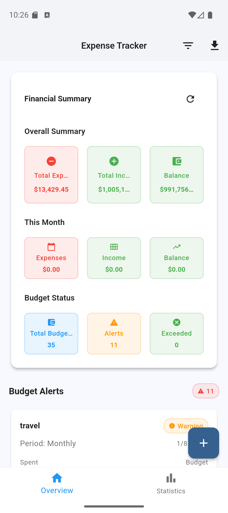

_Main dashboard showcasing financial summary with expense tracking, budget alerts, and quick navigation_

---

### 💰 **Financial Analytics**

Powerful visualizations help you understand your spending patterns and financial trends.

<table>
  <tr>
    <td align="center">
      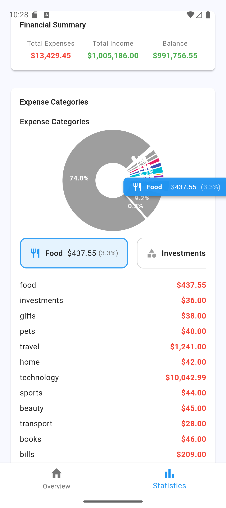
      <br>
      <b>Expense Categories</b><br>
      <em>Detailed breakdown of spending by category with interactive pie charts</em>
    </td>
    <td align="center">
      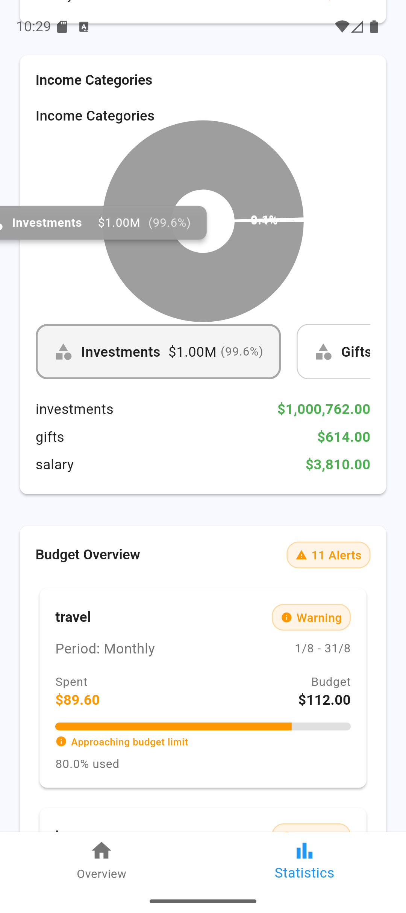
      <br>
      <b>Income Categories</b><br>
      <em>Income distribution and budget overview with progress tracking</em>
    </td>
  </tr>
</table>

---

### 📊 **Advanced Statistics & Goal Tracking**

Enhanced analytics provide deep insights into your financial journey and goal progress.

<table>
  <tr>
    <td align="center">
      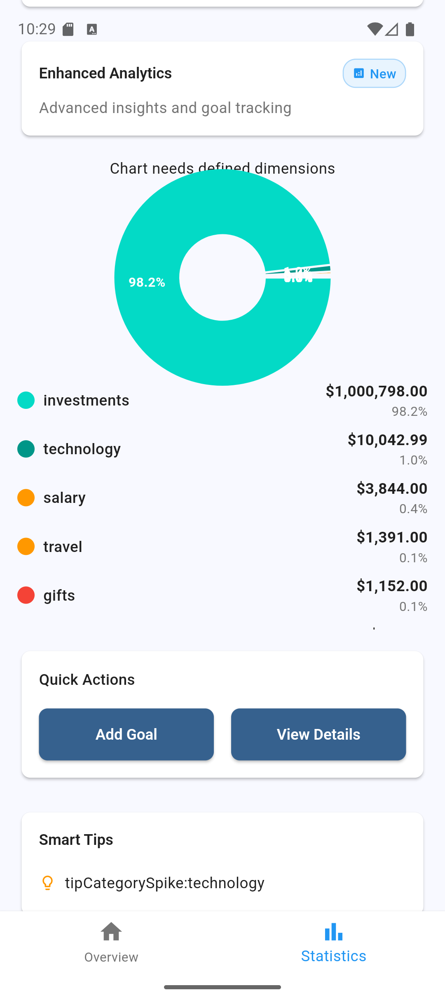
      <br>
      <b>Enhanced Analytics</b><br>
      <em>Advanced insights with goal tracking and smart tips</em>
    </td>
    <td align="center">
      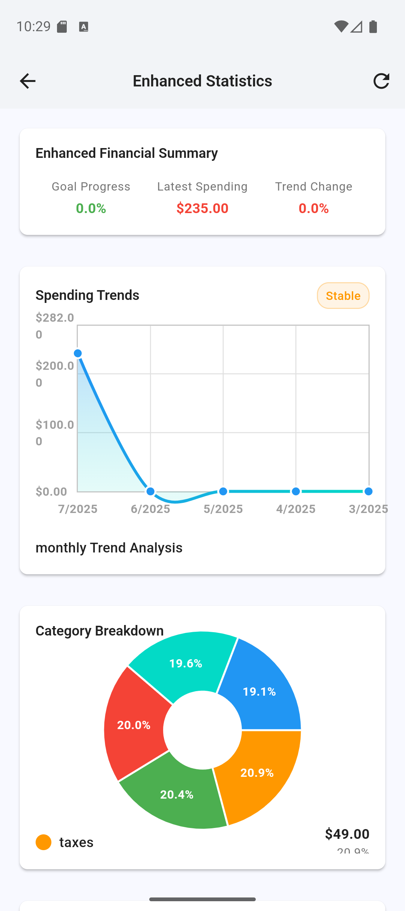
      <br>
      <b>Trend Analysis</b><br>
      <em>Spending trends and category breakdown with visual charts</em>
    </td>
  </tr>
</table>

---

### 💡 **Smart Goal Management**

Set and track financial goals with intuitive goal creation and progress monitoring.

<table>
  <tr>
    <td align="center">
      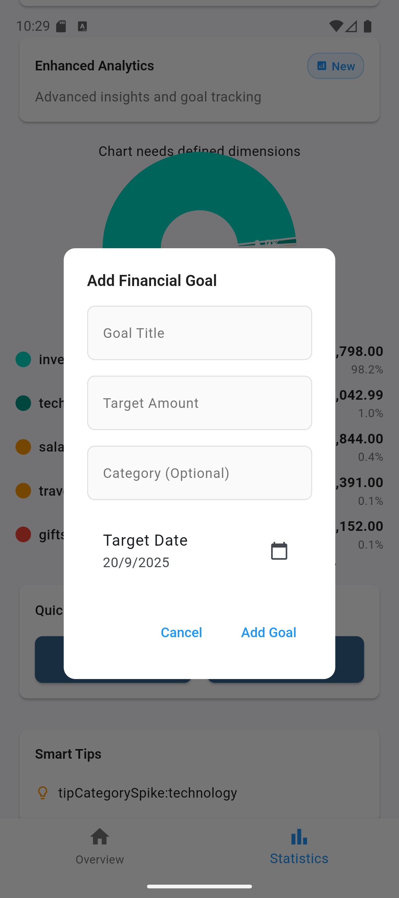
      <br>
      <b>Goal Creation</b><br>
      <em>Easy goal setup with target amounts and dates</em>
    </td>
    <td align="center">
      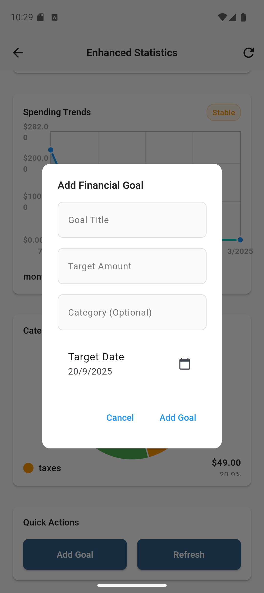
      <br>
      <b>Goal Management</b><br>
      <em>Comprehensive goal tracking from statistics view</em>
    </td>
  </tr>
</table>

---

### 🚨 **Budget Management & Alerts**

Stay on track with intelligent budget monitoring and proactive spending alerts.

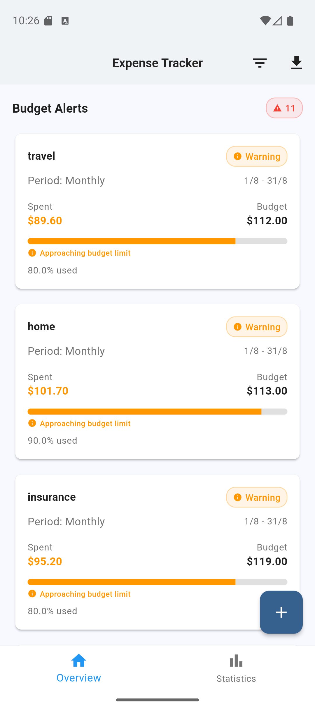

_Budget alerts system with warning indicators and spending progress for multiple categories_

---

### 📝 **Transaction Management**

Effortless expense and income tracking with comprehensive transaction views.

<table>
  <tr>
    <td align="center">
      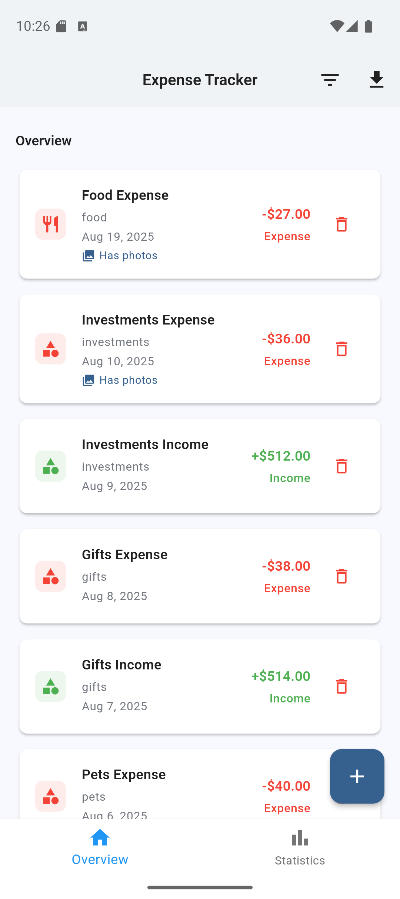
      <br>
      <b>Transaction List</b><br>
      <em>Clean expense overview with categories and amounts</em>
    </td>
    <td align="center">
      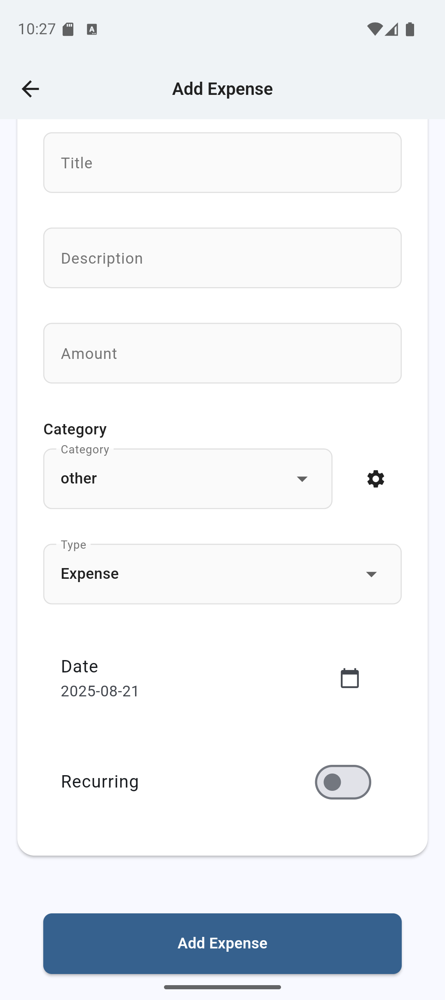
      <br>
      <b>Add Expense</b><br>
      <em>Intuitive expense entry with categories and recurring options</em>
    </td>
  </tr>
</table>

---

### 🔍 **Advanced Filtering & Search**

Powerful search and filtering capabilities to find exactly what you're looking for.

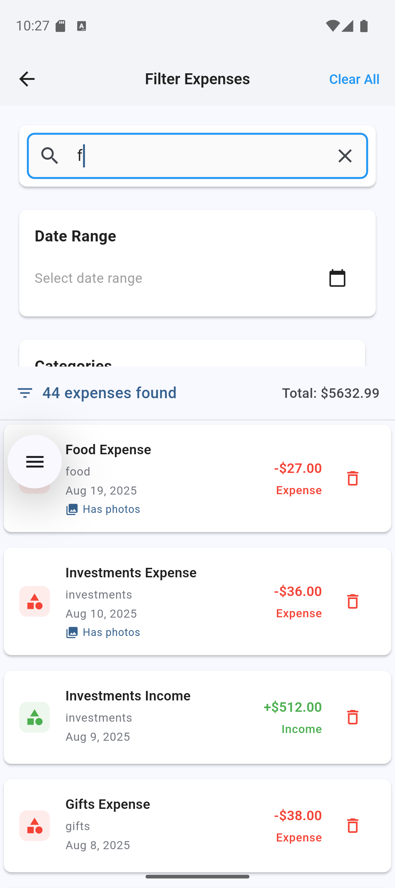

_Advanced filtering with date ranges, categories, and real-time search_

---

### 📤 **Data Export & Management**

Export your financial data in multiple formats for external analysis and backup.

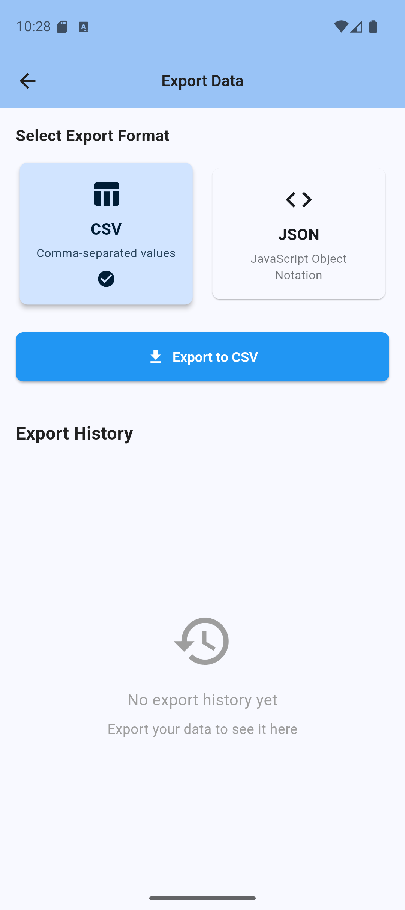

_Data export functionality with CSV and JSON format support_

</div>

---

## 🏗️ Architecture

This application follows **Clean Architecture** principles with **MVVM** pattern, ensuring maintainability, testability, and scalability.

### 🎯 Architectural Principles

- **🏛️ Clean Architecture** - Clear separation of concerns
- **🎭 MVVM Pattern** - Model-View-ViewModel for presentation layer
- **🔄 Reactive Programming** - Using Riverpod for state management
- **📱 Platform-Agnostic** - Core business logic independent of Flutter

### 📐 Architecture Layers

#### 1. **Domain Layer** (Business Logic)

```
📁 domain/
├── 📄 entities/          # Business objects (Expense, Budget, etc.)
├── 📄 repositories/      # Abstract interfaces
├── 📄 usecases/         # Business rules & operations
├── 📄 services/         # Domain services
└── 📄 validators/       # Business validation logic
```

#### 2. **Data Layer** (Infrastructure)

```
📁 data/
├── 📄 datasources/      # Local/Remote data sources
├── 📄 models/           # Data models with serialization
├── 📄 repositories/     # Repository implementations
└── 📄 mappers/          # Data transformation utilities
```

#### 3. **Presentation Layer** (UI/UX)

```
📁 presentation/
├── 📄 views/            # UI screens & widgets
├── 📄 providers/        # Riverpod providers (ViewModels)
├── 📄 widgets/          # Reusable UI components
└── 📄 states/           # UI state management
```

---

### 🔄 Data Flow Architecture

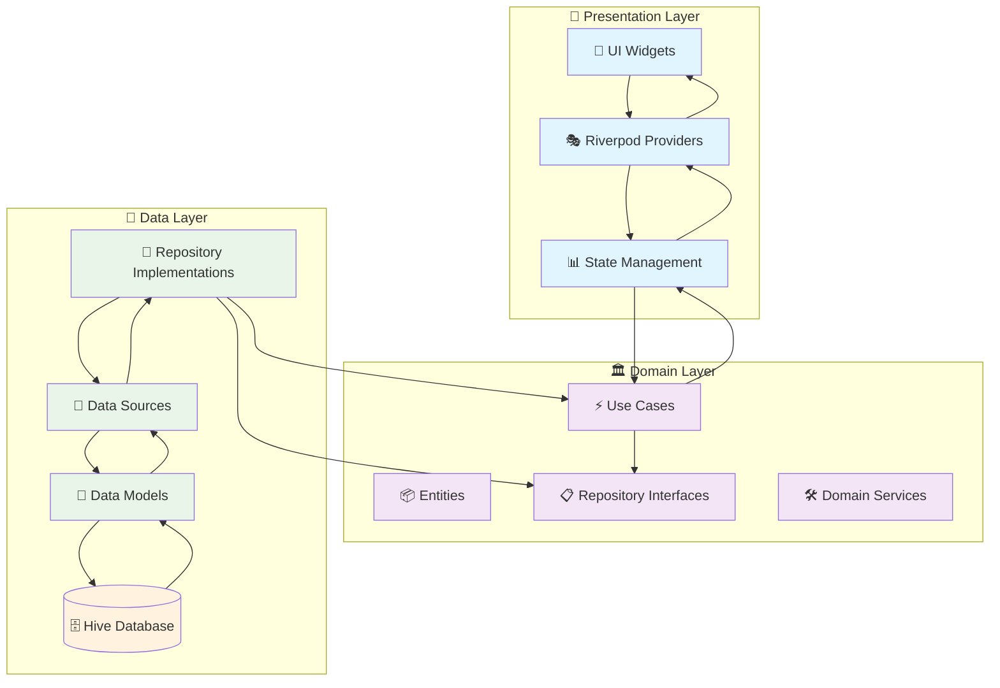

---

### 🎭 Component Interaction Flow

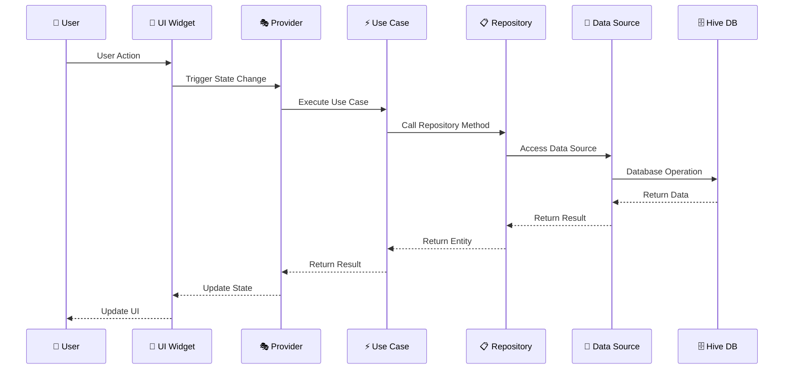

---

### 📊 Feature Module Architecture

```mermaid
graph TD
    subgraph "💰 Expense Feature"
        E_UI[📱 Expense UI]
        E_Provider[🎭 Expense Providers]
        E_UseCase[⚡ Expense Use Cases]
        E_Entity[📦 Expense Entities]
        E_Repo[📋 Expense Repository]
        E_Model[📄 Expense Models]
    end

    subgraph "💳 Budget Feature"
        B_UI[📱 Budget UI]
        B_Provider[🎭 Budget Providers]
        B_UseCase[⚡ Budget Use Cases]
        B_Entity[📦 Budget Entities]
        B_Repo[📋 Budget Repository]
        B_Model[📄 Budget Models]
    end

    subgraph "📊 Statistics Feature"
        S_UI[📱 Stats UI]
        S_Provider[🎭 Stats Providers]
        S_UseCase[⚡ Stats Use Cases]
        S_Entity[📦 Stats Entities]
        S_Repo[📋 Stats Repository]
        S_Model[📄 Stats Models]
    end

    subgraph "📤 Export Feature"
        EX_UI[📱 Export UI]
        EX_Provider[🎭 Export Providers]
        EX_UseCase[⚡ Export Use Cases]
        EX_Entity[📦 Export Entities]
        EX_Repo[📋 Export Repository]
        EX_Model[📄 Export Models]
    end

    E_UI --> E_Provider --> E_UseCase --> E_Entity --> E_Repo --> E_Model
    B_UI --> B_Provider --> B_UseCase --> B_Entity --> B_Repo --> B_Model
    S_UI --> S_Provider --> S_UseCase --> S_Entity --> S_Repo --> S_Model
    EX_UI --> EX_Provider --> EX_UseCase --> EX_Entity --> EX_Repo --> EX_Model

    style E_UI fill:#e3f2fd
    style B_UI fill:#e8f5e8
    style S_UI fill:#fff3e0
    style EX_UI fill:#f3e5f5
```

---

### 🗄️ Database Schema

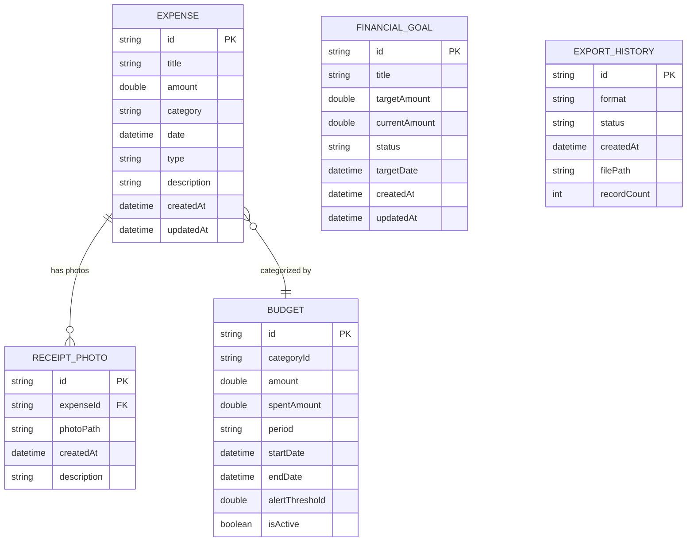

---

### 🚦 State Management Flow

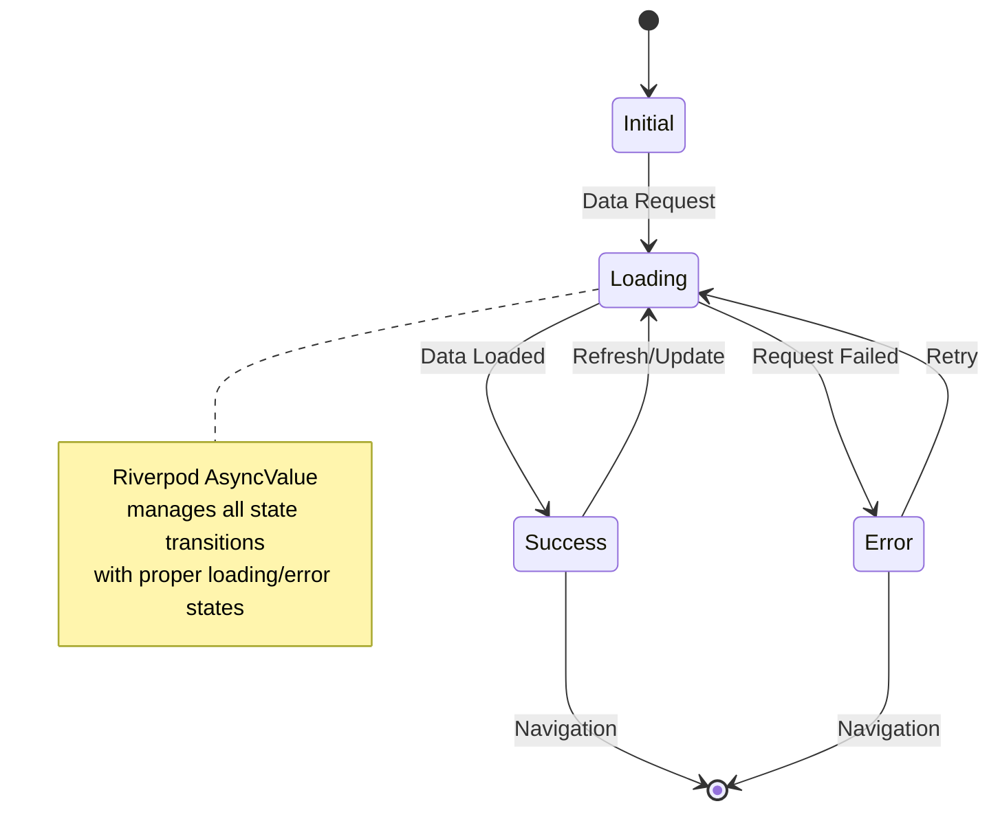

---

### 🧭 Navigation Architecture

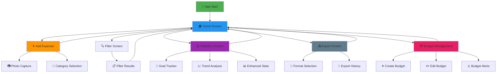

---

## 🚀 Quick Start

### 📋 Prerequisites

| Tool            | Version                   | Purpose                    |
| --------------- | ------------------------- | -------------------------- |
| **Flutter SDK** | `>=3.2.3 <4.0.0`          | Cross-platform development |
| **Dart SDK**    | `>=3.0.0`                 | Programming language       |
| **IDE**         | VS Code or Android Studio | Development environment    |

### 🛠️ Installation

#### For **Beginners** 👶

1. **Install Flutter**

   ```bash
   # Visit https://flutter.dev/docs/get-started/install
   # Follow the installation guide for your OS
   ```

2. **Clone the Repository**

   ```bash
   git clone https://github.com/yourusername/expense-tracker.git
   cd expense-tracker
   ```

3. **Install Dependencies**

   ```bash
   flutter pub get
   ```

4. **Generate Code**

   ```bash
   dart run build_runner build --delete-conflicting-outputs
   ```

5. **Run the App**
   ```bash
   flutter run
   ```

#### For **Expert Developers** 🧙‍♂️

```bash
# Clone and setup in one go
git clone https://github.com/yourusername/expense-tracker.git && cd expense-tracker

# Install dependencies and generate code
flutter pub get && dart run build_runner build --delete-conflicting-outputs

# Run with release mode optimizations
flutter run --release

# Or build for specific platforms
flutter build apk --release          # Android
flutter build ios --release          # iOS
flutter build web --release          # Web
```

### ⚡ Quick Commands

| Command                       | Description                    |
| ----------------------------- | ------------------------------ |
| `flutter run`                 | Run in debug mode              |
| `flutter test`                | Run all tests                  |
| `flutter analyze`             | Static code analysis           |
| `flutter doctor`              | Check setup                    |
| `dart run build_runner build` | Generate code                  |
| `flutter gen-l10n`            | 🌍 Generate localization files |

---

## 📊 Project Structure

```
📦 expense_tracker/
├── 📁 lib/
│   ├── 📁 core/                    # Core utilities & shared code
│   │   ├── 📁 constants/           # App-wide constants
│   │   ├── 📁 errors/             # Error handling
│   │   ├── 📁 logging/            # Logging system
│   │   ├── 📁 services/           # Core services
│   │   ├── 📁 types/              # Custom type definitions
│   │   ├── 📁 utils/              # Utility functions
│   │   └── 📁 validation/         # Validation utilities
│   │
│   ├── 📁 features/               # Feature modules
│   │   ├── 📁 expense/           # 💰 Expense management
│   │   │   ├── 📁 data/          # Data layer
│   │   │   │   ├── 📁 datasources/   # Local data sources
│   │   │   │   ├── 📁 models/        # Data models
│   │   │   │   └── 📁 repositories/  # Repository implementations
│   │   │   ├── 📁 domain/        # Domain layer
│   │   │   │   ├── 📁 entities/      # Business entities
│   │   │   │   ├── 📁 repositories/  # Repository interfaces
│   │   │   │   ├── 📁 usecases/      # Business use cases
│   │   │   │   ├── 📁 services/      # Domain services
│   │   │   │   └── 📁 validators/    # Business validation
│   │   │   └── 📁 presentation/  # Presentation layer
│   │   │       ├── 📁 providers/     # Riverpod providers
│   │   │       ├── 📁 views/         # UI screens
│   │   │       └── 📁 widgets/       # UI components
│   │   │
│   │   ├── 📁 budget/            # 💳 Budget management
│   │   ├── 📁 statistics/        # 📊 Analytics & statistics
│   │   └── 📁 export/            # 📤 Data export
│   │
│   ├── 📁 shared/                 # Shared UI components
│   │   ├── 📁 theme/             # App theming
│   │   └── 📁 widgets/           # Reusable widgets
│   │
│   ├── 📁 l10n/                  # 🌍 Internationalization
│   │   ├── 📄 app_en.arb         # English translations (70+ strings)
│   │   ├── 📄 app_es.arb         # Spanish translations
│   │   └── 📄 app_localizations.dart # Generated localization class
│   └── 📄 main.dart              # App entry point
│
├── 📁 test/                       # Test files (mirrors lib structure)
├── 📁 docs/                       # Documentation
├── 📁 assets/                     # Static assets
├── 📄 l10n.yaml                  # 🌍 Localization configuration
├── 📄 pubspec.yaml               # Project configuration
└── 📄 analysis_options.yaml      # Linting rules
```

---

## 🎯 Features Deep Dive

### 💰 Expense Management

<details>
<summary><strong>🔍 Click to expand Expense Management details</strong></summary>

#### **Core Functionality**

- ✅ **Add/Edit/Delete Expenses** - Full CRUD operations
- ✅ **Category Management** - Custom and predefined categories
- ✅ **Amount Validation** - Business rules for amounts
- ✅ **Date Selection** - Flexible date picking
- ✅ **Description Support** - Optional expense descriptions

#### **Advanced Features**

- ✅ **Receipt Photos** - Capture and store receipt images
- ✅ **Recurring Expenses** - Automatic recurring transactions
- ✅ **Search & Filter** - Find expenses quickly
- ✅ **Bulk Operations** - Select multiple expenses

#### **Technical Implementation**

```dart
// Example: Creating an expense
final expense = Expense(
  id: 'expense_123',
  title: 'Grocery Shopping',
  amount: 45.99,
  category: 'Food',
  date: DateTime.now(),
  type: ExpenseType.expense,
);

// Using the use case
final result = await createExpense(expense);
result.fold(
  (failure) => showError(failure.message),
  (success) => showSuccess('Expense created'),
);
```

</details>

### 💳 Budget Management

<details>
<summary><strong>🔍 Click to expand Budget Management details</strong></summary>

#### **Budget Features**

- ✅ **Category-wise Budgets** - Set limits per category
- ✅ **Budget Alerts** - Notifications when approaching limits
- ✅ **Progress Tracking** - Visual progress indicators
- ✅ **Budget History** - Track budget performance over time

#### **Smart Alerts**

- 🔔 **75% Warning** - First alert at 75% usage
- ⚠️ **90% Critical** - Critical alert at 90% usage
- 🚫 **100% Exceeded** - Alert when budget exceeded

#### **Visual Analytics**

- 📊 **Progress Bars** - Visual budget consumption
- 📈 **Trend Charts** - Budget performance over time
- 🎯 **Goal Tracking** - Track savings goals

</details>

### 📊 Statistics & Analytics

<details>
<summary><strong>🔍 Click to expand Statistics details</strong></summary>

#### **Statistical Views**

- 📈 **Trend Analysis** - Spending trends over time
- 🥧 **Category Breakdown** - Pie charts for categories
- 📊 **Monthly/Weekly Reports** - Periodic summaries
- 🎯 **Goal Progress** - Financial goal tracking

#### **Advanced Analytics**

- 📉 **Expense Patterns** - Identify spending patterns
- 📊 **Income vs Expenses** - Comprehensive overview
- 🔍 **Custom Date Ranges** - Flexible reporting periods
- 📈 **Forecasting** - Predict future expenses

</details>

### 📤 Export & Backup

<details>
<summary><strong>🔍 Click to expand Export details</strong></summary>

#### **Export Formats**

- 📄 **CSV Export** - Spreadsheet-compatible format
- 📋 **JSON Export** - Structured data format
- 📊 **PDF Reports** - Print-ready reports (planned)

#### **Export Features**

- 🗓️ **Date Range Selection** - Export specific periods
- 📂 **Category Filtering** - Export by categories
- 📜 **Export History** - Track all exports
- 🔄 **Auto-Backup** - Scheduled backups (planned)

</details>

---

## 🧪 Testing

This project maintains **high test coverage** with comprehensive testing strategy.

### 📊 Test Coverage Overview

| Layer            | Coverage | Test Types   |
| ---------------- | -------- | ------------ |
| **Domain**       | ~95%     | Unit Tests   |
| **Data**         | ~90%     | Unit Tests   |
| **Presentation** | ~85%     | Widget Tests |
| **Integration**  | ~70%     | E2E Tests    |

### 🧪 Test Architecture

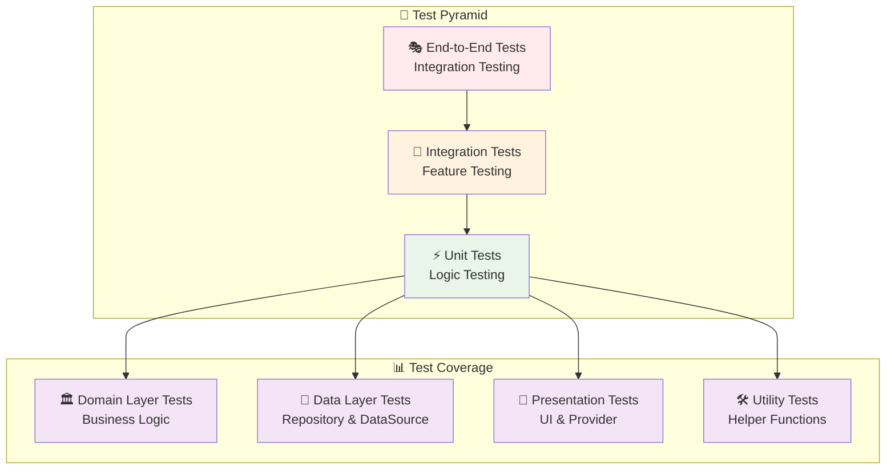

### 🚀 Running Tests

#### **Basic Test Commands**

```bash
# Run all tests
flutter test

# Run specific test file
flutter test test/features/expense/domain/usecases/create_expense_test.dart

# Run tests with coverage
flutter test --coverage
genhtml coverage/lcov.info -o coverage/html

# Run integration tests
flutter test integration_test/

# Run tests in watch mode (reruns on file changes)
flutter test --watch

# Run tests with verbose output
flutter test --verbose
```

#### **Advanced Testing Commands**

```bash
# Run tests with specific name pattern
flutter test --plain-name "should create expense"

# Run tests for specific directory
flutter test test/features/expense/

# Run tests with timeout
flutter test --timeout=30s

# Run tests and generate detailed coverage report
flutter test --coverage && dart run coverage:test_with_coverage

# Run tests on specific device/emulator
flutter test --device-id=<device_id>
```

#### **Test Coverage Analysis**

```bash
# Generate HTML coverage report
flutter test --coverage
genhtml coverage/lcov.info -o coverage/html

# View coverage in browser
open coverage/html/index.html  # macOS
xdg-open coverage/html/index.html  # Linux
start coverage/html/index.html  # Windows

# Generate coverage summary
lcov --summary coverage/lcov.info
```

#### **Platform-Specific Testing**

```bash
# Run tests on Android emulator
flutter test --device-id android

# Run tests on iOS simulator
flutter test --device-id ios

# Run web tests
flutter test --platform chrome

# Run tests with Flutter driver (E2E)
flutter drive --target=test_driver/app.dart
```

### 🧪 Test Examples

<details>
<summary><strong>🔍 Click to see test examples</strong></summary>

#### **Unit Test Example**

```dart
group('CreateExpense', () {
  test('should create expense successfully', () async {
    // Arrange
    final expense = Expense(
      id: 'test_id',
      title: 'Test Expense',
      amount: 100.0,
      category: 'Food',
      date: DateTime.now(),
      type: ExpenseType.expense,
    );

    when(() => mockRepository.createExpense(expense))
        .thenAnswer((_) async => const Right(null));

    // Act
    final result = await usecase(expense);

    // Assert
    expect(result, const Right(null));
    verify(() => mockRepository.createExpense(expense));
  });
});
```

#### **Widget Test Example**

```dart
testWidgets('ExpenseCard displays expense information', (tester) async {
  // Arrange
  const expense = Expense(
    id: 'test_id',
    title: 'Test Expense',
    amount: 50.0,
    category: 'Food',
  );

  // Act
  await tester.pumpWidget(
    MaterialApp(
      home: ExpenseCard(expense: expense),
    ),
  );

  // Assert
  expect(find.text('Test Expense'), findsOneWidget);
  expect(find.text('\$50.00'), findsOneWidget);
  expect(find.text('Food'), findsOneWidget);
});
```

</details>

### 📝 Testing Best Practices

#### **Test Organization**

```
test/
├── features/                   # Feature-specific tests
│   ├── expense/
│   │   ├── data/              # Data layer tests
│   │   │   ├── datasources/   # DataSource tests
│   │   │   ├── models/        # Model tests
│   │   │   └── repositories/  # Repository implementation tests
│   │   ├── domain/            # Domain layer tests
│   │   │   ├── entities/      # Entity tests
│   │   │   ├── usecases/      # UseCase tests
│   │   │   └── validators/    # Validation tests
│   │   └── presentation/      # Presentation layer tests
│   │       ├── providers/     # Provider tests
│   │       └── widgets/       # Widget tests
│   ├── budget/
│   ├── statistics/
│   └── export/
├── helpers/                   # Test helpers & utilities
│   ├── test_data.dart        # Mock data
│   ├── mock_dependencies.dart # Mock services
│   └── test_helpers.dart     # Test utilities
├── integration_test/          # Integration tests
│   ├── app_test.dart         # Full app testing
│   └── feature_flows/        # Feature-specific flows
└── golden/                   # Golden file tests (UI snapshots)
    └── widgets/
```

#### **Test Quality Guidelines**

**✅ Good Test Practices:**

```dart
// ✅ Descriptive test names
test('should return expense when repository call succeeds', () {
  // Test implementation
});

// ✅ Arrange-Act-Assert pattern
test('should validate expense title correctly', () {
  // Arrange
  const invalidTitle = '';
  
  // Act
  final result = ExpenseValidators.validateTitle(invalidTitle);
  
  // Assert
  expect(result.isLeft(), true);
  expect(result.fold((l) => l, (r) => ''), 'Title is required');
});

// ✅ Test edge cases
test('should handle null values gracefully', () {
  final result = ExpenseValidators.validateTitle(null);
  expect(result.isLeft(), true);
});
```

**❌ Anti-patterns to Avoid:**

```dart
// ❌ Vague test names
test('test expense', () { /* ... */ });

// ❌ Testing implementation details
test('should call repository.save()', () { /* ... */ });

// ❌ Overly complex tests
test('should do many things at once', () {
  // Tests multiple behaviors - should be split
});
```

#### **Mock Strategy**

```dart
// Use Mocktail for mocking
import 'package:mocktail/mocktail.dart';

class MockExpenseRepository extends Mock implements ExpenseRepository {}
class MockNotificationService extends Mock implements NotificationService {}

// Setup in test
setUp(() {
  mockRepository = MockExpenseRepository();
  mockNotificationService = MockNotificationService();
  
  // Register fallback values
  registerFallbackValue(Expense.empty());
});
```

#### **Widget Testing Strategy**

```dart
// Test widget behavior, not implementation
testWidgets('ExpenseCard shows expense information and handles tap', (tester) async {
  // Arrange
  const expense = Expense(id: '1', title: 'Coffee', amount: 5.0);
  var tapped = false;
  
  // Act
  await tester.pumpWidget(
    MaterialApp(
      home: ExpenseCard(
        expense: expense,
        onTap: () => tapped = true,
      ),
    ),
  );
  
  // Assert - Check UI elements
  expect(find.text('Coffee'), findsOneWidget);
  expect(find.text('\$5.00'), findsOneWidget);
  
  // Assert - Test interaction
  await tester.tap(find.byType(ExpenseCard));
  expect(tapped, true);
});
```

#### **Test Data Management**

```dart
// Create test data factories
class TestData {
  static Expense expense({
    String? id,
    String? title,
    double? amount,
    String? category,
  }) => Expense(
    id: id ?? 'test_id',
    title: title ?? 'Test Expense',
    amount: amount ?? 100.0,
    category: category ?? 'Food',
    date: DateTime(2024, 1, 1),
    type: ExpenseType.expense,
  );
  
  static List<Expense> expenseList(int count) =>
      List.generate(count, (i) => expense(id: 'expense_$i'));
}
```

#### **Integration Testing Guidelines**

```dart
// Test complete user journeys
testWidgets('User can create and view expense', (tester) async {
  app.main();
  await tester.pumpAndSettle();
  
  // Navigate to add expense
  await tester.tap(find.byIcon(Icons.add));
  await tester.pumpAndSettle();
  
  // Fill expense form
  await tester.enterText(find.byKey(Key('title_field')), 'Coffee');
  await tester.enterText(find.byKey(Key('amount_field')), '5.00');
  
  // Submit form
  await tester.tap(find.byKey(Key('save_button')));
  await tester.pumpAndSettle();
  
  // Verify expense appears in list
  expect(find.text('Coffee'), findsOneWidget);
  expect(find.text('\$5.00'), findsOneWidget);
});
```

#### **Test Performance & Optimization**

```bash
# Run tests with profiling
flutter test --reporter=expanded --verbose

# Measure test execution time
time flutter test

# Run tests in parallel (if supported)
flutter test --concurrency=4

# Skip integration tests during development
flutter test --exclude-tags=integration
```

#### **Continuous Integration (CI) Testing**

```yaml
# .github/workflows/test.yml
name: Tests
on: [push, pull_request]

jobs:
  test:
    runs-on: ubuntu-latest
    steps:
      - uses: actions/checkout@v3
      - uses: subosito/flutter-action@v2
        with:
          flutter-version: '3.16.0'
      
      - name: Install dependencies
        run: flutter pub get
      
      - name: Run tests
        run: |
          flutter test --coverage
          flutter test integration_test/
      
      - name: Upload coverage
        uses: codecov/codecov-action@v3
        with:
          file: coverage/lcov.info
```

#### **Test Debugging**

```dart
// Debug test failures
test('debug example', () async {
  // Add debug prints
  print('Testing with value: $testValue');
  
  // Use debugger
  debugger(); // Will pause in debug mode
  
  // Test with detailed assertions
  expect(result, isA<Success>(), 
    reason: 'Expected Success but got: ${result.runtimeType}');
});

// Test with custom matchers
Matcher hasExpenseWithTitle(String title) => predicate<List<Expense>>(
  (expenses) => expenses.any((e) => e.title == title),
  'contains expense with title "$title"',
);
```

---

## 📦 Build & Deployment

### 🏗️ Build Commands

<details>
<summary><strong>🔍 Click to expand build details</strong></summary>

#### **Android**

```bash
# Debug APK
flutter build apk --debug

# Release APK
flutter build apk --release

# App Bundle (recommended for Play Store)
flutter build appbundle --release

# Build with specific flavor
flutter build apk --release --flavor production
```

#### **iOS**

```bash
# Debug build
flutter build ios --debug

# Release build
flutter build ios --release

# Build for simulator
flutter build ios --simulator
```

#### **Web**

```bash
# Debug build
flutter build web --debug

# Release build
flutter build web --release

# Build with base href
flutter build web --base-href="/expense-tracker/"
```

#### **Desktop**

```bash
# Windows
flutter build windows --release

# macOS
flutter build macos --release

# Linux
flutter build linux --release
```

</details>

### 🚀 Deployment Pipeline

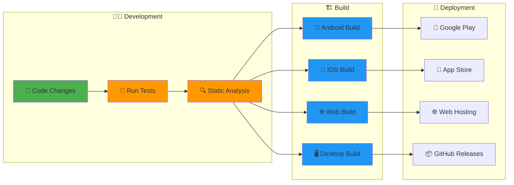

### 📋 Deployment Prerequisites

#### **Development Environment Setup**

```bash
# Verify Flutter installation
flutter doctor -v

# Check for any missing dependencies
flutter doctor --android-licenses

# Ensure all required tools are installed
flutter doctor
```

#### **Pre-deployment Checklist**

- ✅ **All tests passing** - `flutter test` succeeds
- ✅ **No lint errors** - `flutter analyze` clean
- ✅ **Code generation complete** - `dart run build_runner build`
- ✅ **Localization generated** - `flutter gen-l10n` 
- ✅ **Version updated** - Update `pubspec.yaml` version
- ✅ **Changelog updated** - Document new features/fixes
- ✅ **Release notes prepared** - User-facing change summary

### 🤖 Android Deployment

#### **Debug Build**

```bash
# Generate debug APK
flutter build apk --debug

# Install on connected device
flutter install

# Build and run directly
flutter run --debug
```

#### **Release Build**

```bash
# Generate release APK
flutter build apk --release

# Generate App Bundle (recommended for Play Store)
flutter build appbundle --release

# Build with specific target platform
flutter build apk --target-platform android-arm,android-arm64,android-x64
```

#### **Google Play Store Deployment**

**Step 1: Configure Signing**

```bash
# Generate upload keystore (one-time setup)
keytool -genkey -v -keystore upload-keystore.jks -keyalg RSA -keysize 2048 -validity 10000 -alias upload

# Create key.properties file
echo "storePassword=YOUR_STORE_PASSWORD
keyPassword=YOUR_KEY_PASSWORD
keyAlias=upload
storeFile=../upload-keystore.jks" > android/key.properties
```

**Step 2: Configure Gradle**

```gradle
// android/app/build.gradle
android {
    ...
    signingConfigs {
        release {
            keyAlias keystoreProperties['keyAlias']
            keyPassword keystoreProperties['keyPassword']
            storeFile keystoreProperties['storeFile'] ? file(keystoreProperties['storeFile']) : null
            storePassword keystoreProperties['storePassword']
        }
    }
    buildTypes {
        release {
            signingConfig signingConfigs.release
        }
    }
}
```

**Step 3: Build and Upload**

```bash
# Build signed App Bundle
flutter build appbundle --release

# Upload to Play Console
# File location: build/app/outputs/bundle/release/app-release.aab
```

#### **Firebase App Distribution**

```bash
# Install Firebase CLI
npm install -g firebase-tools

# Login to Firebase
firebase login

# Initialize Firebase in project
firebase init

# Build and distribute
flutter build apk --release
firebase appdistribution:distribute build/app/outputs/flutter-apk/app-release.apk \
    --app 1:123456789:android:abcd1234 \
    --groups testers
```

### 🍎 iOS Deployment

#### **Debug Build**

```bash
# Build for iOS simulator
flutter build ios --debug --simulator

# Build for physical device
flutter build ios --debug

# Run on connected iOS device
flutter run --debug
```

#### **Release Build**

```bash
# Build release iOS app
flutter build ios --release

# Build with specific configuration
flutter build ios --release --flavor production
```

#### **App Store Deployment**

**Step 1: Xcode Configuration**

```bash
# Open iOS project in Xcode
open ios/Runner.xcworkspace

# Configure in Xcode:
# - Signing & Capabilities
# - Bundle Identifier
# - Version and Build Number
# - App Icons and Launch Screen
```

**Step 2: Archive and Upload**

```bash
# Archive in Xcode (Product > Archive)
# Or use command line:
xcodebuild -workspace ios/Runner.xcworkspace \
           -scheme Runner \
           -configuration Release \
           -destination generic/platform=iOS \
           -archivePath build/Runner.xcarchive \
           archive

# Upload to App Store Connect
xcodebuild -exportArchive \
           -archivePath build/Runner.xcarchive \
           -exportOptionsPlist ios/ExportOptions.plist \
           -exportPath build/
```

**Step 3: TestFlight Distribution**

```bash
# Upload to TestFlight via Xcode
# Or use Transporter app
# Or use command line tools with Application Loader
```

### 🌐 Web Deployment

#### **Build for Web**

```bash
# Build web app
flutter build web --release

# Build with base href for subdirectory deployment
flutter build web --base-href="/expense-tracker/"

# Build with specific renderer
flutter build web --web-renderer canvaskit  # or html
```

#### **Static Hosting Deployment**

**Vercel Deployment:**

```bash
# Install Vercel CLI
npm i -g vercel

# Deploy to Vercel
flutter build web --release
cd build/web
vercel --prod
```

**Netlify Deployment:**

```bash
# Install Netlify CLI
npm install -g netlify-cli

# Deploy to Netlify
flutter build web --release
netlify deploy --prod --dir=build/web
```

**Firebase Hosting:**

```bash
# Install Firebase CLI
npm install -g firebase-tools

# Initialize Firebase hosting
firebase init hosting

# Build and deploy
flutter build web --release
firebase deploy --only hosting
```

**GitHub Pages:**

```yaml
# .github/workflows/deploy.yml
name: Deploy to GitHub Pages

on:
  push:
    branches: [main]

jobs:
  deploy:
    runs-on: ubuntu-latest
    steps:
      - uses: actions/checkout@v3
      - uses: subosito/flutter-action@v2
      - run: flutter pub get
      - run: flutter build web --base-href="/expense-tracker/"
      - uses: peaceiris/actions-gh-pages@v3
        with:
          github_token: ${{ secrets.GITHUB_TOKEN }}
          publish_dir: ./build/web
```

### 🖥️ Desktop Deployment

#### **Windows**

```bash
# Build Windows app
flutter build windows --release

# Create installer with Inno Setup or NSIS
# Package as MSIX for Microsoft Store
flutter build windows --release
dart run msix:create
```

#### **macOS**

```bash
# Build macOS app
flutter build macos --release

# Create DMG installer
# Sign for macOS distribution
codesign --force --verify --verbose --sign "Developer ID Application: Your Name" \
         build/macos/Build/Products/Release/expense_tracker.app

# Create installer package
productbuild --component build/macos/Build/Products/Release/expense_tracker.app \
             /Applications expense_tracker.pkg
```

#### **Linux**

```bash
# Build Linux app
flutter build linux --release

# Create AppImage
# Create .deb package
# Create Snap package
snapcraft
```

### 🔄 Continuous Deployment (CD)

#### **GitHub Actions Workflow**

```yaml
# .github/workflows/deploy.yml
name: Build and Deploy

on:
  push:
    tags:
      - 'v*'

jobs:
  build-android:
    runs-on: ubuntu-latest
    steps:
      - uses: actions/checkout@v3
      - uses: actions/setup-java@v3
        with:
          distribution: 'zulu'
          java-version: '17'
      - uses: subosito/flutter-action@v2
        with:
          flutter-version: '3.16.0'
      
      - name: Build Android
        run: |
          flutter pub get
          flutter build appbundle --release
      
      - name: Upload to Play Store
        uses: r0adkll/upload-google-play@v1
        with:
          serviceAccountJsonPlainText: ${{ secrets.SERVICE_ACCOUNT_JSON }}
          packageName: com.yourcompany.expense_tracker
          releaseFiles: build/app/outputs/bundle/release/app-release.aab
          track: production

  build-ios:
    runs-on: macos-latest
    steps:
      - uses: actions/checkout@v3
      - uses: subosito/flutter-action@v2
      - name: Build iOS
        run: |
          flutter pub get
          flutter build ios --release --no-codesign
      
      - name: Upload to App Store
        uses: apple-actions/upload-testflight-build@v1
        with:
          app-path: build/ios/iphoneos/Runner.app
          issuer-id: ${{ secrets.APPSTORE_ISSUER_ID }}
          api-key-id: ${{ secrets.APPSTORE_KEY_ID }}
          api-private-key: ${{ secrets.APPSTORE_PRIVATE_KEY }}

  build-web:
    runs-on: ubuntu-latest
    steps:
      - uses: actions/checkout@v3
      - uses: subosito/flutter-action@v2
      - name: Build Web
        run: |
          flutter pub get
          flutter build web --release
      
      - name: Deploy to Firebase
        uses: FirebaseExtended/action-hosting-deploy@v0
        with:
          repoToken: '${{ secrets.GITHUB_TOKEN }}'
          firebaseServiceAccount: '${{ secrets.FIREBASE_SERVICE_ACCOUNT }}'
          projectId: your-project-id
```

### 📊 Release Management

#### **Version Management**

```yaml
# pubspec.yaml
version: 1.2.3+45
# format: major.minor.patch+build
```

```bash
# Automated version bumping
dart pub global activate cider
cider bump patch  # 1.2.3 → 1.2.4
cider bump minor  # 1.2.3 → 1.3.0
cider bump major  # 1.2.3 → 2.0.0
```

#### **Release Notes Generation**

```bash
# Generate changelog
git log --oneline --pretty=format:"%h %s" v1.2.2..HEAD

# Create GitHub release
gh release create v1.2.3 \
  --title "Release v1.2.3" \
  --notes-file CHANGELOG.md \
  build/app/outputs/bundle/release/app-release.aab
```

#### **Environment Management**

```dart
// lib/config/environment.dart
class Environment {
  static const String apiUrl = String.fromEnvironment(
    'API_URL',
    defaultValue: 'https://api.staging.example.com',
  );
  
  static const bool isProduction = bool.fromEnvironment('PRODUCTION');
}
```

```bash
# Build with environment variables
flutter build apk --release --dart-define=PRODUCTION=true --dart-define=API_URL=https://api.production.com
```

### ⚙️ Configuration

<details>
<summary><strong>🔍 Click to expand configuration details</strong></summary>

#### **Environment Configuration**

```yaml
# pubspec.yaml
environment:
  sdk: ">=3.2.3 <4.0.0"
  flutter: ">=3.2.3"

# Different build flavors
flutter:
  assets:
    - assets/images/
    - assets/icons/

  generate: true
  uses-material-design: true
```

#### **Platform-specific Settings**

```dart
// main.dart - Platform detection
if (PlatformWidgets.isIOS) {
  return CupertinoApp(/* iOS config */);
} else {
  return MaterialApp(/* Android config */);
}
```

</details>

---

## 🤝 Contributing

We welcome contributions from developers of all skill levels!

### 🎯 How to Contribute

#### **For Beginners** 👶

1. 🍴 **Fork the repository**
2. 🔧 **Set up development environment** (see [Quick Start](#-quick-start))
3. 🐛 **Look for "good first issue" labels**
4. 📝 **Make your changes**
5. 🧪 **Write tests for your changes**
6. 📤 **Submit a Pull Request**

#### **For Expert Developers** 🧙‍♂️

1. 🏗️ **Understand the architecture** (see [Architecture](#️-architecture))
2. 🎯 **Choose complex issues or propose new features**
3. 📋 **Follow Clean Architecture principles**
4. 🧪 **Ensure high test coverage**
5. 📖 **Update documentation**
6. 🔍 **Review code quality**

### 📋 Contribution Guidelines

<details>
<summary><strong>🔍 Click to expand contribution guidelines</strong></summary>

#### **Code Style**

- ✅ Follow Dart/Flutter conventions
- ✅ Use meaningful variable names
- ✅ Add inline documentation
- ✅ Follow Clean Architecture layers
- ✅ Write comprehensive tests

#### **Commit Messages**

```bash
# Format: type(scope): description
feat(expense): add photo attachment feature
fix(budget): resolve alert notification issue
docs(readme): update installation instructions
test(export): add unit tests for CSV export
```

#### **Pull Request Process**

1. 🔍 **Code Review** - All PRs require review
2. 🧪 **Tests Required** - Must pass all tests
3. 📖 **Documentation** - Update docs if needed
4. ✅ **Lint Checks** - Must pass static analysis
5. 🎯 **Feature Complete** - Include comprehensive implementation

#### **Branch Naming**

```bash
feature/photo-attachment-system
bugfix/budget-alert-notification
hotfix/critical-data-loss
docs/architecture-documentation
```

</details>

### 🏛️ Architecture Guidelines

<details>
<summary><strong>🔍 Click to expand architecture guidelines</strong></summary>

#### **Adding New Features**

1. **📦 Create Feature Structure**

   ```
   lib/features/new_feature/
   ├── data/
   ├── domain/
   └── presentation/
   ```

2. **🏛️ Domain Layer First**

   ```dart
   // 1. Create entity
   class NewEntity extends Equatable { ... }

   // 2. Create repository interface
   abstract class NewRepository { ... }

   // 3. Create use cases
   class CreateNew { ... }
   ```

3. **💾 Data Layer Second**

   ```dart
   // 1. Create data model
   class NewModel { ... }

   // 2. Create data source
   class NewDataSource { ... }

   // 3. Implement repository
   class NewRepositoryImpl implements NewRepository { ... }
   ```

4. **🎨 Presentation Layer Last**

   ```dart
   // 1. Create provider
   class NewNotifier extends AsyncNotifier { ... }

   // 2. Create UI screens
   class NewScreen extends ConsumerWidget { ... }
   ```

#### **Testing Requirements**

- ✅ **Domain Layer**: 95%+ test coverage
- ✅ **Data Layer**: 90%+ test coverage
- ✅ **Presentation**: 80%+ test coverage
- ✅ **Integration Tests**: Happy path + error cases

</details>

### 🐛 Bug Reports

<details>
<summary><strong>🔍 Click to expand bug report template</strong></summary>

#### **Bug Report Template**

```markdown
## 🐛 Bug Report

### Description

Brief description of the bug

### 🔄 Steps to Reproduce

1. Go to '...'
2. Click on '...'
3. See error

### ✅ Expected Behavior

What you expected to happen

### ❌ Actual Behavior

What actually happened

### 📱 Environment

- Flutter version: [e.g. 3.2.3]
- Platform: [e.g. Android 12, iOS 16]
- Device: [e.g. Pixel 6, iPhone 13]

### 📸 Screenshots

If applicable, add screenshots

### 🧪 Additional Context

Any other context about the problem
```

</details>

---

## 📚 Documentation

### 📖 Available Documentation

| Document                                  | Description              | Audience      |
| ----------------------------------------- | ------------------------ | ------------- |
| [📋 README.md](README.md)                 | Project overview & setup | Everyone      |
| [🏗️ Architecture](docs/architecture.md)   | Technical architecture   | Developers    |
| [📋 PRD](docs/prd.md)                     | Product requirements     | Product Team  |
| [🧪 Testing Guide](docs/testing-guide.md) | Testing strategies       | QA/Developers |
| [🚀 Deployment](docs/deployment.md)       | Deployment procedures    | DevOps        |

### 📚 Learning Resources

#### **For Flutter Beginners**

- 📖 [Flutter Documentation](https://flutter.dev/docs)
- 🎥 [Flutter YouTube Channel](https://youtube.com/flutterdev)
- 📚 [Dart Language Tour](https://dart.dev/guides/language/language-tour)

#### **For Architecture Learning**

- 📖 [Clean Architecture](https://blog.cleancoder.com/uncle-bob/2012/08/13/the-clean-architecture.html)
- 📚 [MVVM Pattern](https://en.wikipedia.org/wiki/Model%E2%80%93view%E2%80%93viewmodel)
- 🎯 [Riverpod Documentation](https://riverpod.dev/)

---

## 🔧 Troubleshooting

<details>
<summary><strong>🔍 Click to expand troubleshooting guide</strong></summary>

### Common Issues & Solutions

#### **Build Issues**

```bash
# Clear build cache
flutter clean && flutter pub get

# Regenerate code
dart run build_runner build --delete-conflicting-outputs

# Update dependencies
flutter pub deps
```

#### **Hive Database Issues**

```bash
# Clear Hive boxes (in development)
# This will reset all local data
```

#### **Platform-specific Issues**

**Android:**

```bash
# Update Android SDK
flutter doctor --android-licenses

# Clean Android build
cd android && ./gradlew clean
```

**iOS:**

```bash
# Clean iOS build
cd ios && rm -rf Pods/ Podfile.lock
pod install
```

**Web:**

```bash
# Enable web support
flutter config --enable-web

# Run on web
flutter run -d chrome
```

</details>

---

## 🛡️ Security & Privacy

### 🔒 Security Features

- ✅ **Local-Only Storage** - No external data transmission
- ✅ **Input Validation** - Prevent injection attacks
- ✅ **Secure File Handling** - Safe photo storage
- ✅ **Permission Handling** - Minimal required permissions

### 🔐 Privacy Policy

- 📱 **No Data Collection** - All data stays on device
- 🔒 **No Analytics** - No usage tracking
- 🚫 **No External Services** - Completely offline
- 💾 **User Control** - Complete data ownership

---

## 🚀 Performance

### ⚡ Performance Optimizations

- 🎯 **Lazy Loading** - Load data on demand
- 🗄️ **Efficient Database** - Hive for fast local storage
- 🔄 **State Management** - Optimized Riverpod usage
- 📱 **Memory Management** - Proper widget disposal
- 🖼️ **Image Optimization** - Compressed photo storage

### 📊 Performance Metrics

| Metric                | Target | Actual |
| --------------------- | ------ | ------ |
| **App Launch Time**   | <2s    | ~1.5s  |
| **Screen Navigation** | <100ms | ~80ms  |
| **Database Query**    | <50ms  | ~30ms  |
| **Photo Capture**     | <500ms | ~400ms |

---

## 🔮 Roadmap

### 🎯 Short-term Goals (Next 3 months)

- [ ] 🌐 **Web App Optimization** - Better responsive design
- [ ] 📱 **Widget Support** - Home screen widgets
- [ ] 🔄 **Data Sync** - Cloud backup options
- [ ] 🎨 **UI Improvements** - Enhanced animations

### 🚀 Long-term Vision (6+ months)

- [ ] 🤖 **AI-Powered Insights** - Smart spending analysis
- [ ] 👥 **Multi-User Support** - Family expense tracking
- [ ] 🌍 **Multi-Currency** - International support
- [ ] 📊 **Advanced Reports** - Detailed financial reports

---

## 📄 License

This project is licensed under the **MIT License** - see the [LICENSE](LICENSE) file for details.

```
MIT License

Copyright (c) 2024 Expense Tracker

Permission is hereby granted, free of charge, to any person obtaining a copy
of this software and associated documentation files (the "Software"), to deal
in the Software without restriction, including without limitation the rights
to use, copy, modify, merge, publish, distribute, sublicense, and/or sell
copies of the Software, and to permit persons to whom the Software is
furnished to do so, subject to the following conditions:

The above copyright notice and this permission notice shall be included in all
copies or substantial portions of the Software.
```

---

## 🙏 Acknowledgments

### 💝 Special Thanks

- 🛠️ **Flutter Team** - For the amazing cross-platform framework
- 🎭 **Riverpod Team** - For excellent state management
- 🗄️ **Hive Team** - For fast local database solution
- 📊 **FL Chart Team** - For beautiful chart widgets
- 🎨 **Material Design Team** - For design system
- 👥 **Open Source Community** - For continuous inspiration

<!-- ALL-CONTRIBUTORS-LIST:START - Do not remove or modify this section -->
<!-- This will be populated automatically -->
<!-- ALL-CONTRIBUTORS-LIST:END -->

---

<div align="center">

## ⭐ Star History

[](https://star-history.com/#yourusername/expense-tracker&Date)

---

### 💖 Show Your Support

If you found this project helpful, please consider:

⭐ **Starring the repository**  
🐛 **Reporting bugs**  
💡 **Suggesting features**  
🤝 **Contributing code**  
📢 **Sharing with others**

---

**📱 Built with ❤️ using Flutter & Clean Architecture**

_Empowering users to take control of their financial life through beautiful, intuitive expense tracking._

[🔝 Back to Top](#-expense-tracker---production-grade-flutter-app)

</div>
