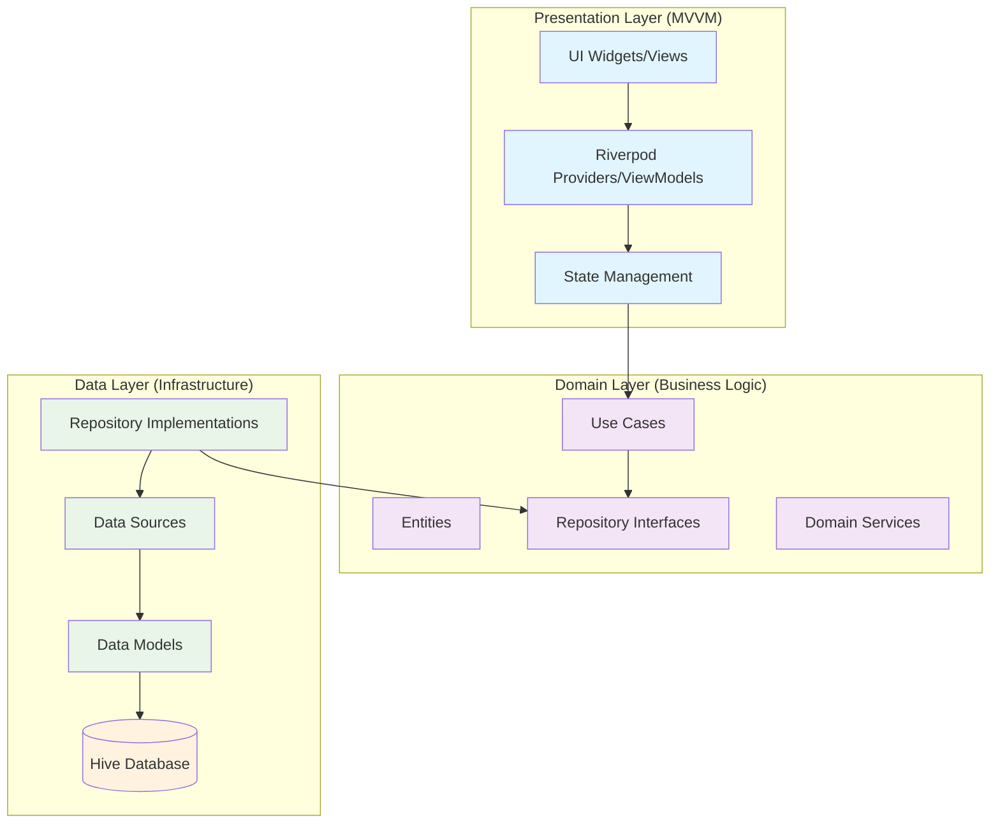
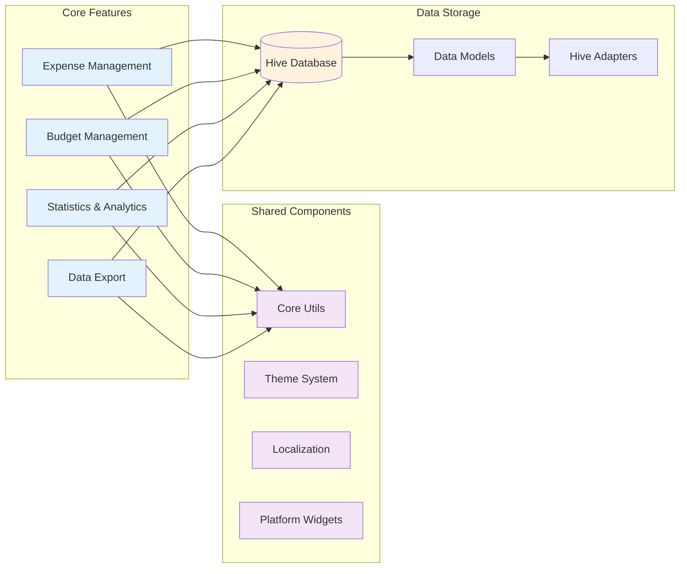
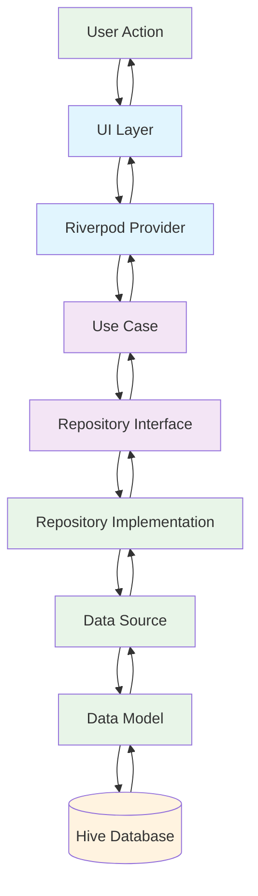
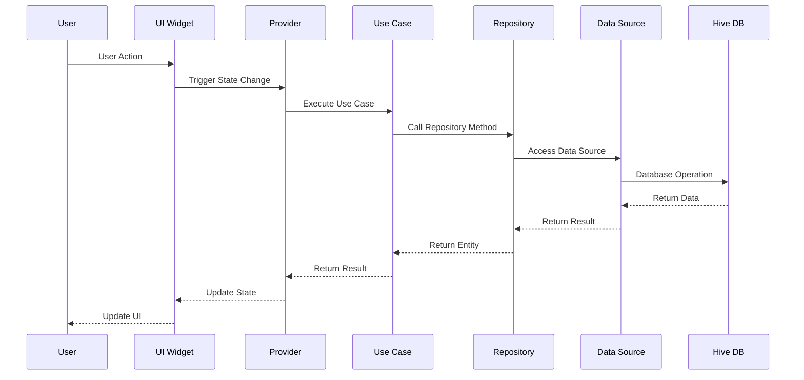
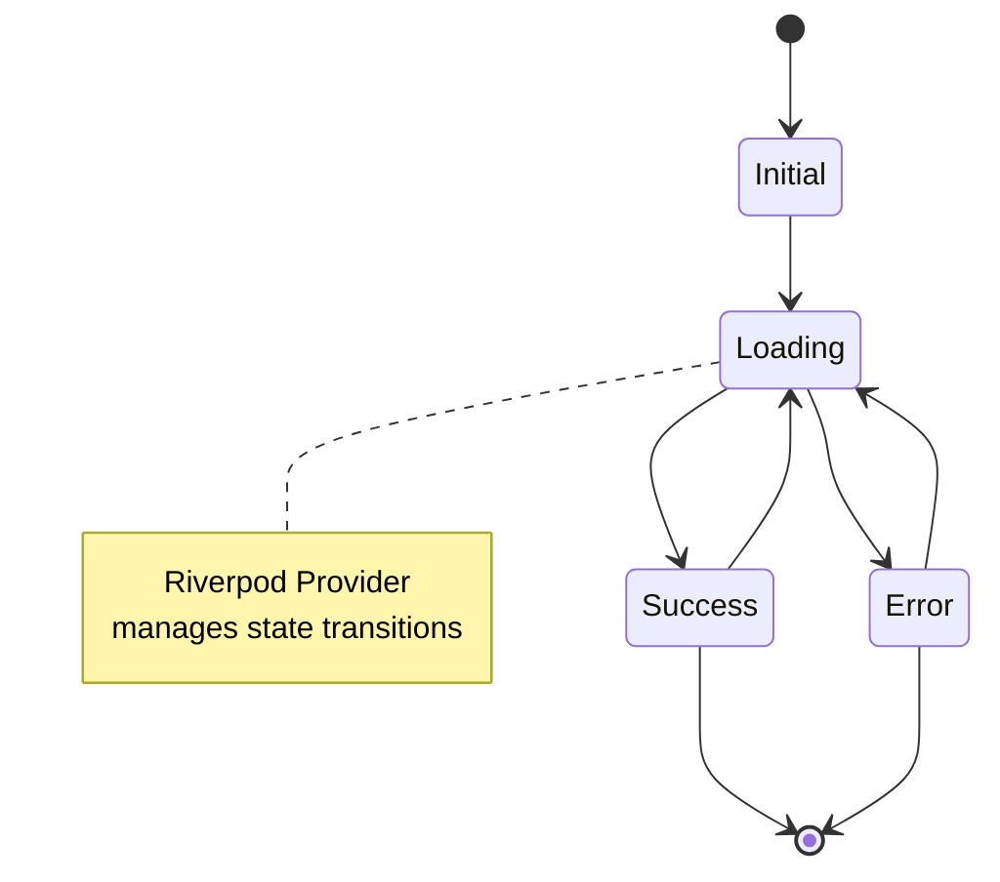
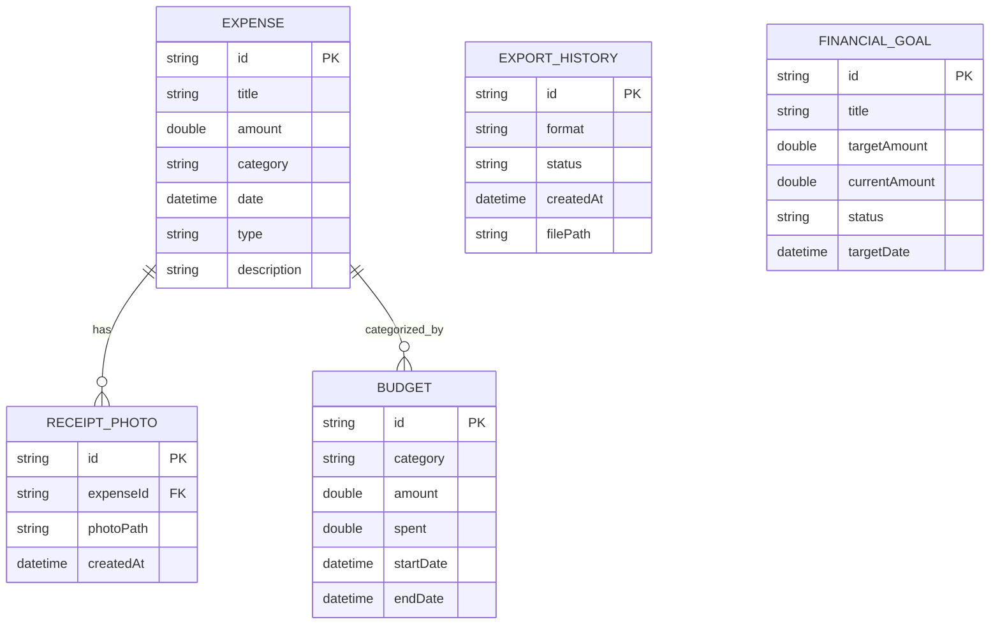
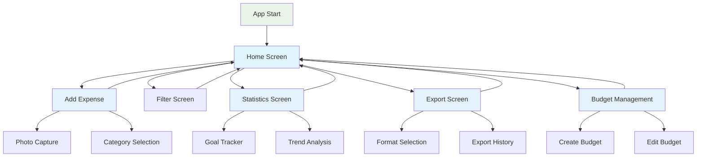
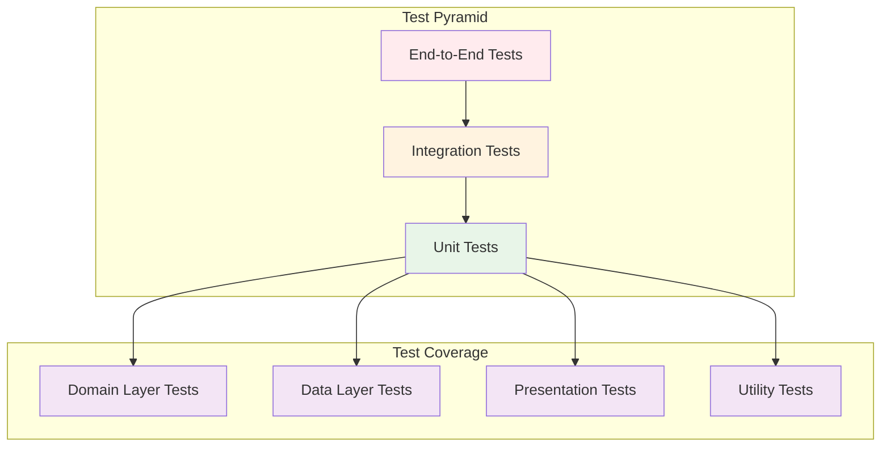
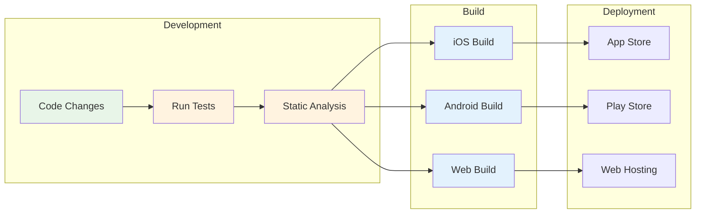

# Expense Tracker

A modern, intelligent Expense Tracker application built with Flutter using MVVM architecture and Clean Architecture principles. This production-grade app features robust state management with Riverpod, efficient local storage with Hive, and a beautiful Material Design 3 UI.

## 🚀 Features

- **Add & Track Expenses**: Easily add expenses and income with categories
- **Real-time Statistics**: View monthly summaries, category breakdowns, and balance tracking
- **Modern UI**: Beautiful Material Design 3 interface with light/dark theme support
- **Offline First**: All data stored locally using Hive database
- **Responsive Design**: Works seamlessly across mobile, tablet, and desktop
- **Clean Architecture**: Modular, testable, and maintainable codebase

## 🏗️ Architecture

This app follows **Clean Architecture** principles with **MVVM** pattern:

### Layers:

- **Domain Layer**: Business logic, entities, use cases, and repository interfaces
- **Data Layer**: Repository implementations, data sources, and models
- **Presentation Layer**: UI components, providers, and state management

### Key Technologies:

- **Flutter**: Cross-platform UI framework
- **Riverpod**: State management and dependency injection
- **Hive**: Fast, lightweight local database
- **Dartz**: Functional programming utilities
- **Equatable**: Value equality for entities

## 📊 Project Architecture Diagrams

### 1. High-Level Architecture Overview



### 2. Feature-Based Architecture



### 3. Data Flow Architecture



### 4. Component Interaction Diagram



### 5. Feature Module Structure

```mermaid
graph TD
    subgraph "Expense Feature"
        E_UI[Expense UI]
        E_Provider[Expense Providers]
        E_UseCase[Expense Use Cases]
        E_Entity[Expense Entities]
        E_Repo[Expense Repository]
        E_Model[Expense Models]
    end

    subgraph "Budget Feature"
        B_UI[Budget UI]
        B_Provider[Budget Providers]
        B_UseCase[Budget Use Cases]
        B_Entity[Budget Entities]
        B_Repo[Budget Repository]
        B_Model[Budget Models]
    end

    subgraph "Statistics Feature"
        S_UI[Stats UI]
        S_Provider[Stats Providers]
        S_UseCase[Stats Use Cases]
        S_Entity[Stats Entities]
        S_Repo[Stats Repository]
        S_Model[Stats Models]
    end

    subgraph "Export Feature"
        EX_UI[Export UI]
        EX_Provider[Export Providers]
        EX_UseCase[Export Use Cases]
        EX_Entity[Export Entities]
        EX_Repo[Export Repository]
        EX_Model[Export Models]
    end

    E_UI --> E_Provider
    E_Provider --> E_UseCase
    E_UseCase --> E_Entity
    E_Entity --> E_Repo
    E_Repo --> E_Model

    B_UI --> B_Provider
    B_Provider --> B_UseCase
    B_UseCase --> B_Entity
    B_Entity --> B_Repo
    B_Repo --> B_Model

    S_UI --> S_Provider
    S_Provider --> S_UseCase
    S_UseCase --> S_Entity
    S_Entity --> S_Repo
    S_Repo --> S_Model

    EX_UI --> EX_Provider
    EX_Provider --> EX_UseCase
    EX_UseCase --> EX_Entity
    EX_Entity --> EX_Repo
    EX_Repo --> EX_Model

    style E_UI fill:#e3f2fd
    style B_UI fill:#e3f2fd
    style S_UI fill:#e3f2fd
    style EX_UI fill:#e3f2fd
```



### 6. State Management Flow



### 7. Database Schema Overview



### 8. Navigation Flow



### 9. Testing Architecture



### 10. Build & Deployment Pipeline



## 📱 Screenshots

_Screenshots will be added after first run_

## 🛠️ Setup & Installation

### Prerequisites

- Flutter SDK (3.2.3 or higher)
- Dart SDK (3.0.0 or higher)
- Android Studio / VS Code with Flutter extensions

### Installation Steps

1. **Clone the repository**

   ```bash
   git clone <repository-url>
   cd expense_tracker
   ```

2. **Install dependencies**

   ```bash
   flutter pub get
   ```

3. **Generate code** (for Hive adapters and Riverpod providers)

   ```bash
   dart run build_runner build --delete-conflicting-outputs
   ```

4. **Run the app**
   ```bash
   flutter run
   ```

## 📁 Project Structure

```
lib/
├── core/
│   ├── constants/          # App constants and theme
│   ├── errors/            # Error handling and failures
│   └── utils/             # Utility functions
├── features/
│   └── expense/
│       ├── data/          # Data layer
│       │   ├── datasources/
│       │   ├── models/
│       │   └── repositories/
│       ├── domain/        # Domain layer
│       │   ├── entities/
│       │   ├── repositories/
│       │   └── usecases/
│       └── presentation/  # Presentation layer
│           ├── providers/
│           ├── views/
│           └── widgets/
├── shared/
│   ├── theme/             # App theming
│   └── widgets/           # Shared UI components
└── main.dart              # App entry point
```

---

## 🏛️ Architecture & Contribution Guide

### Clean Architecture & MVVM

- **Domain Layer**: Business logic, entities, use cases, repository interfaces. No dependencies on other layers.
- **Data Layer**: Repository implementations, data sources, models. Implements domain interfaces.
- **Presentation Layer (MVVM)**: UI widgets (Views), Riverpod providers (ViewModels/Notifiers), and state management. No direct data access or business logic.

### Adding a New Feature (Best Practice)

1. **Create a Feature Directory**
   - `lib/features/<feature_name>/`
2. **Domain Layer**
   - Define entities in `domain/entities/`
   - Define repository interfaces in `domain/repositories/`
   - Add use cases in `domain/usecases/`
3. **Data Layer**
   - Implement repositories in `data/repositories/`
   - Add data sources in `data/datasources/`
   - Add models in `data/models/`
4. **Presentation Layer**
   - Add providers (ViewModels/Notifiers) in `presentation/providers/`
   - Add UI screens in `presentation/views/`
   - Add widgets in `presentation/widgets/`
5. **Testing**
   - Add unit tests for use cases in `test/features/<feature_name>/domain/usecases/`
   - Add widget/UI tests in `test/features/<feature_name>/presentation/views/`

### Example: Adding a New Use Case

- Add a Dart file in `domain/usecases/` (e.g., `add_budget.dart`).
- Implement business rule validation in the use case, not in the UI or repository.
- Write unit tests for all validation and logic.

### Running Tests

```bash
flutter test
```

### Code Quality

- Run static analysis:

```bash
flutter analyze
```

- Follow lints in `analysis_options.yaml`.

### Pull Requests

- Write or update tests for new features/bugfixes.
- Ensure all tests and lints pass before submitting a PR.
- Follow the architecture and directory structure above.

---

## 🎨 UI Components

- **Home Screen**: Overview of expenses with summary cards
- **Add Expense Screen**: Form to add new expenses/income
- **Stats Screen**: Detailed statistics and category breakdown
- **Expense List**: Scrollable list of all transactions
- **Summary Cards**: Visual representation of financial data

## 🔧 Configuration

### Environment Setup

The app is configured for production use with:

- Material Design 3 theming
- Responsive layouts
- Error handling and loading states
- Local data persistence

### Customization

- Colors and themes can be modified in `lib/core/constants/app_constants.dart`
- Add new expense categories in `lib/features/expense/domain/entities/expense.dart`

## 🧪 Testing

Run tests with:

```bash
flutter test
```

## 📦 Building for Production

### Android

```bash
flutter build apk --release
```

### iOS

```bash
flutter build ios --release
```

### Web

```bash
flutter build web --release
```

## 🤝 Contributing

1. Fork the repository
2. Create a feature branch (`git checkout -b feature/amazing-feature`)
3. Commit your changes (`git commit -m 'Add amazing feature'`)
4. Push to the branch (`git push origin feature/amazing-feature`)
5. Open a Pull Request

## 📄 License

This project is licensed under the MIT License - see the [LICENSE](LICENSE) file for details.

## 🙏 Acknowledgments

- Flutter team for the amazing framework
- Riverpod for excellent state management
- Hive for fast local storage
- Material Design team for the design system

---

**Built with ❤️ using Flutter**
