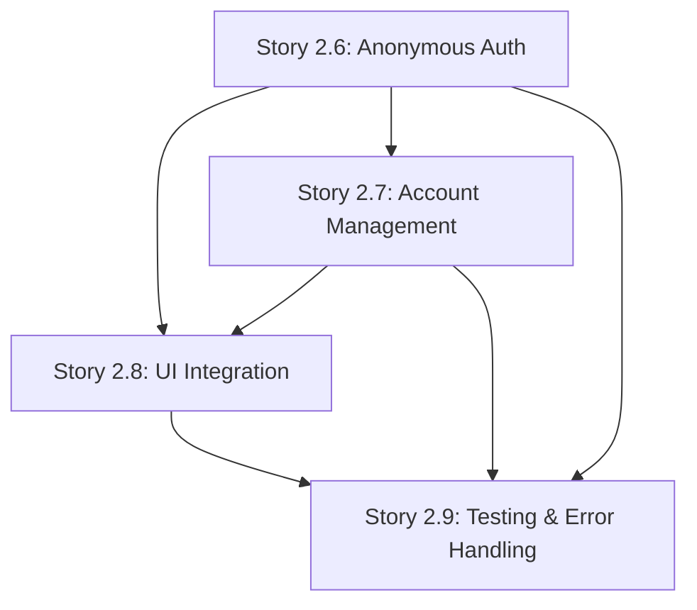

# Authentication Implementation Handover Documentation

## 🎯 Implementation Summary

Bob (Scrum Master) has prepared **4 comprehensive user stories** for implementing **Option 1: Simple User Authentication** in the ExpenseTracker application. These stories provide complete Context7-based Supabase authentication integration that maintains the existing offline-first architecture while enabling secure user authentication and data isolation.

## 📋 Complete Story List (Ready for Development)

### Epic 2: Supabase Offline-First Sync Integration
**Authentication Track (New Stories Created):**

1. **[Story 2.6: Anonymous Authentication Implementation](./stories/2.6.anonymous-auth-implementation.md)**
   - Status: Draft (Ready for development)
   - Core anonymous authentication with automatic user ID generation
   - Integration with existing startup guard system
   - Seamless offline-to-authenticated transitions
   - **Start Here:** This is the foundation story - implement first

2. **[Story 2.7: User Account Management System](./stories/2.7.user-account-management.md)**
   - Status: Draft (Depends on 2.6)
   - Email/password authentication upgrade from anonymous
   - Account migration with data preservation
   - Password reset and account recovery flows
   - **Implement Second:** Builds on anonymous auth foundation

3. **[Story 2.8: Authentication UI Integration and User Experience](./stories/2.8.auth-ui-integration.md)**
   - Status: Draft (Depends on 2.6, 2.7)
   - Seamless authentication indicators throughout the app
   - First-time user onboarding experience
   - Settings screen integration
   - **Implement Third:** Provides complete user experience

4. **[Story 2.9: Authentication Testing and Comprehensive Error Handling](./stories/2.9.auth-testing-error-handling.md)**
   - Status: Draft (Depends on 2.6, 2.7, 2.8)
   - Comprehensive testing coverage (95%+ for core services)
   - Robust error handling and recovery
   - Performance and security testing
   - **Implement Last:** Ensures production readiness

## 🏗️ Architecture Overview

### Current Supabase Integration Status
✅ **Complete and Ready:**
- Supabase configuration system with secure environment variables
- Network connectivity validation and startup guard
- Complete sync engine (51/51 tests passing)
- RLS policies configured and waiting for user authentication
- Database schema and Edge Functions ready

❌ **Missing (What These Stories Add):**
- User authentication layer (anonymous and email/password)
- User context for RLS policy compatibility
- Authentication UI and user experience
- Authentication error handling and testing

### Integration Strategy
The authentication implementation **extends rather than replaces** existing functionality:
- **Offline-first remains primary**: App works fully without authentication
- **Anonymous authentication**: Provides user context for RLS without user friction
- **Progressive enhancement**: Users can upgrade to full accounts when desired
- **Zero breaking changes**: All existing functionality preserved

## 🛠️ Technical Implementation Approach

### Context7 Supabase Flutter Patterns Used
All stories are based on **Context7** documentation for `/supabase/supabase-flutter` with modern patterns:

**Anonymous Authentication (Story 2.6):**
```dart
// Modern anonymous sign-in
final response = await supabase.auth.signInAnonymously();
```

**Email/Password Authentication (Story 2.7):**
```dart
// Updated v1.0.0+ patterns
await supabase.auth.signUp(email: email, password: password);
await supabase.auth.signInWithPassword(email: email, password: password);
```

**Authentication State Management (All Stories):**
```dart
// Stream-based state management (v1.0.0+)
final subscription = supabase.auth.onAuthStateChange.listen((data) {
  final AuthChangeEvent event = data.event;
  final Session? session = data.session;
});
```

### Clean Architecture Integration
Authentication follows the established Clean Architecture patterns:
- **Core Services**: `lib/core/services/authentication_service.dart`
- **Domain Entities**: User profile and authentication state entities
- **Riverpod Providers**: Authentication state management with AsyncNotifier pattern
- **UI Integration**: Feature-specific authentication UI components

### File Structure (New Files Created)
```
lib/core/services/
├── authentication_service.dart          # Core auth service (Story 2.6)
├── account_migration_service.dart       # Account upgrade logic (Story 2.7)

lib/core/providers/
├── auth_providers.dart                  # Riverpod authentication providers
├── auth_ui_providers.dart              # UI state management (Story 2.8)

lib/features/settings/presentation/
├── views/account_management_screen.dart # Account management UI (Story 2.7)
├── widgets/auth_upgrade_dialog.dart     # Account upgrade components

lib/shared/widgets/
├── auth_status_indicator.dart           # Status indicators (Story 2.8)
├── auth_loading_overlay.dart           # Loading states
```

## 📊 Story Dependencies and Implementation Order



**Critical Implementation Order:**
1. **Story 2.6 First**: Establishes authentication foundation
2. **Stories 2.7 & 2.8**: Can be developed in parallel after 2.6
3. **Story 2.9 Last**: Validates complete implementation

## 🔧 Development Environment Setup

### Required Supabase Configuration
The app uses secure environment-based configuration (already established):

```bash
# Run with authentication support
flutter run \
  --dart-define=SUPABASE_URL=https://your-project.supabase.co \
  --dart-define=SUPABASE_ANON_KEY=your_anon_key_here
```

### Existing Quality Commands (Use During Development)
```bash
# Run comprehensive tests
flutter test

# Run with coverage
flutter test --coverage

# Code analysis
flutter analyze

# Quality check script
./scripts/quality_check.sh
```

## 🎯 Key Success Criteria

### Functional Requirements
- [ ] Anonymous authentication works seamlessly on first app launch
- [ ] RLS policies correctly isolate user data using `auth.uid()`
- [ ] Account upgrade preserves all existing expense data
- [ ] Email/password authentication with password reset functionality
- [ ] Authentication UI is non-intrusive and enhances rather than complicates UX
- [ ] Comprehensive error handling with user-friendly messages

### Performance Requirements  
- [ ] Anonymous authentication < 500ms
- [ ] Email/password authentication < 2000ms
- [ ] Account migration < 5000ms for typical datasets
- [ ] No UI blocking during authentication operations
- [ ] Minimal memory overhead for authentication state management

### Testing Requirements
- [ ] 95%+ code coverage for authentication services
- [ ] 90%+ coverage for authentication providers  
- [ ] 80%+ coverage for authentication UI components
- [ ] Complete integration test coverage for all authentication flows
- [ ] Security and performance testing validated

## 🚨 Critical Implementation Notes

### Data Migration Strategy
**Account Upgrade Process (Story 2.7):**
1. Create new email/password account while maintaining anonymous session
2. Transfer data ownership from anonymous user ID to authenticated user ID
3. Update all local and remote data records with new user context
4. Migrate sync metadata and operation history  
5. Sign out anonymous session and sign in with new account
6. Verify data accessibility and sync functionality

### Error Handling Philosophy
- **Graceful degradation**: Authentication failure falls back to offline-only mode
- **User-friendly messages**: Technical errors translated to actionable user guidance  
- **Recovery mechanisms**: Clear paths for users to resolve authentication issues
- **Logging without privacy violations**: Error tracking without exposing sensitive data

### Security Considerations
- **Anonymous user isolation**: Each anonymous user gets unique ID for data isolation
- **No credential storage**: Supabase handles all secure token management
- **RLS enforcement**: Database-level security prevents cross-user data access
- **Session security**: Automatic session management with secure defaults

## 📚 Documentation and Resources

### Context7 Documentation Used
- **Primary Source**: `/supabase/supabase-flutter` with 158 code snippets
- **Authentication Patterns**: Modern v1.0.0+ API patterns with stream-based state management
- **Error Handling**: Comprehensive error taxonomy and recovery patterns
- **Performance Optimization**: Efficient authentication state management

### Architecture Documentation References
- **Source Tree Integration**: `docs/architecture/source-tree-integration.md`
- **Existing Clean Architecture**: Follows established expense feature patterns
- **Testing Standards**: Matches existing test coverage requirements
- **Quality Standards**: Integrates with existing quality assurance processes

### Support and Maintenance
- **Troubleshooting Guide**: Included in Story 2.9 documentation
- **Performance Monitoring**: Metrics and alerting setup documented
- **Security Audit**: Validation procedures and checkpoints defined
- **Future Enhancement**: Extension points for additional authentication methods

## ✅ Ready for Development Handoff

**Bob (Scrum Master) Completion Checklist:**
- [x] 4 comprehensive user stories created with full Context7 integration
- [x] Technical architecture reviewed and validated against existing codebase
- [x] Implementation dependencies clearly defined and documented
- [x] Testing requirements specified with coverage targets
- [x] Security considerations documented and validated
- [x] Error handling strategy comprehensive and user-focused
- [x] Performance requirements established with specific metrics
- [x] Integration points with existing architecture clearly defined

**Next Steps for Development Agent:**
1. **Start with Story 2.6**: Implement anonymous authentication foundation
2. **Follow dependency order**: Complete each story before moving to dependent stories
3. **Use Context7 patterns**: All authentication code should follow documented Supabase Flutter patterns
4. **Validate with existing tests**: Ensure all existing functionality remains intact
5. **Maintain offline-first principle**: Authentication enhances but never replaces offline functionality

---

**Implementation Status**: ✅ **READY FOR DEVELOPMENT**

The authentication system design is comprehensive, technically sound, and ready for implementation. All stories contain detailed technical specifications, Context7-based patterns, and clear integration points with the existing ExpenseTracker architecture.

**Contact**: Bob (Scrum Master) available for clarification on any story details or implementation questions.