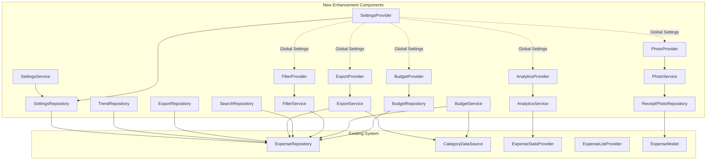

# Expense Tracker Brownfield Enhancement Architecture

## Introduction

This document outlines the architectural approach for enhancing your Flutter expense tracker with advanced features including budget management, receipt photo attachment, advanced filtering and search, data export capabilities, enhanced statistics and analytics, and improved settings/preferences. Its primary goal is to serve as the guiding architectural blueprint for AI-driven development of new features while ensuring seamless integration with the existing Clean Architecture system.

**Relationship to Existing Architecture:**
This document supplements your existing Clean Architecture by defining how new components will integrate with your current Domain-Data-Presentation layer separation, Riverpod state management, and Hive database patterns. Where conflicts arise between new and existing patterns, this document provides guidance on maintaining consistency while implementing enhancements.

### Existing Project Analysis

**Current Project State:**

- **Primary Purpose:** Mobile expense tracking application with local data storage
- **Current Tech Stack:** Flutter 3.2.3+, Riverpod (state management), Hive (local NoSQL database), fl_chart (visualization)
- **Architecture Style:** Clean Architecture with clear Domain-Data-Presentation layer separation
- **Deployment Method:** Local-only deployment with platform-specific UI adaptations (Material Design for Android, Cupertino for iOS)

**Available Documentation:**

- ✅ Source code with comprehensive inline documentation
- ✅ Clean Architecture structure clearly defined in code organization
- ✅ Platform-specific UI patterns established with PlatformWidgets utility
- ✅ Multi-language support (English/Spanish) with localization framework
- ❌ No formal technical architecture documentation
- ❌ No API documentation (local-only app)

**Identified Constraints:**

- Local-only data storage with Hive database
- No cloud sync or external API integrations currently
- Platform-specific UI adaptations must be maintained
- Existing expense categorization system must remain intact
- Recurring transaction functionality must be preserved
- Multi-language support must be maintained

### Change Log

| Change                        | Date       | Version | Description                                               | Author          |
| ----------------------------- | ---------- | ------- | --------------------------------------------------------- | --------------- |
| Initial Architecture Creation | 2024-12-19 | 1.0.0   | Created comprehensive brownfield enhancement architecture | Architect Agent |

## Enhancement Scope and Integration Strategy

### Enhancement Overview

**Enhancement Type:** New Feature Addition with Major Feature Modification
**Scope:** Comprehensive enhancement adding budget management, receipt photos, advanced filtering, data export, enhanced analytics, and settings/preferences
**Integration Impact:** Moderate to Significant Impact - Adding new features while maintaining existing functionality

### Integration Approach

**Code Integration Strategy:** New features will extend the existing Clean Architecture pattern by adding new feature modules that follow the established Domain-Data-Presentation layer separation. Each new feature will be implemented as a separate feature module within the existing `lib/features/` structure.

**Database Integration:** New features will extend the existing Hive database schema by adding new Hive boxes for budget data, receipt photos, and settings. All new data models will follow the established pattern of using HiveType annotations and custom adapters, maintaining backward compatibility with existing expense data.

**API Integration:** Since the current system is local-only, new features will integrate with existing data providers and repositories. Any future external API integrations will follow the established repository pattern in the data layer.

**UI Integration:** New UI components will follow the existing PlatformWidgets pattern for cross-platform compatibility. New screens will integrate into the current bottom navigation structure or use modal presentations, maintaining the established Material Design (Android) and Cupertino (iOS) patterns.

### Compatibility Requirements

- **Existing API Compatibility:** All existing expense CRUD operations, category management, and statistics calculations must remain unchanged and fully functional
- **Database Schema Compatibility:** The existing Hive database schema for expenses, categories, and metadata must remain compatible without requiring data migration
- **UI/UX Consistency:** New UI elements must maintain visual and interaction consistency with existing screens
- **Performance Impact:** Enhancement must maintain existing performance characteristics and not exceed current memory usage by more than 20%

## Tech Stack Alignment

### Existing Technology Stack

| Category             | Current Technology     | Version           | Usage in Enhancement                      | Notes                                   |
| -------------------- | ---------------------- | ----------------- | ----------------------------------------- | --------------------------------------- |
| **Framework**        | Flutter                | 3.2.3+            | Core framework for all new features       | Maintain existing Flutter version       |
| **Language**         | Dart                   | 3.2.3+            | Primary development language              | All new code must use Dart              |
| **State Management** | Riverpod               | 2.4.9             | State management for new features         | Extend existing provider patterns       |
| **Database**         | Hive                   | 2.2.3             | Local storage for new data models         | Add new Hive boxes for new features     |
| **UI Framework**     | Material/Cupertino     | Platform-specific | UI components for new screens             | Follow existing PlatformWidgets pattern |
| **Charts**           | fl_chart               | 0.66.0            | Enhanced visualizations                   | Extend existing chart usage             |
| **Code Generation**  | build_runner           | 2.4.7             | Code generation for new models            | Maintain existing generation patterns   |
| **Testing**          | flutter_test           | SDK               | Unit and widget testing                   | Extend existing test patterns           |
| **Localization**     | intl                   | 0.19.0            | Multi-language support                    | Maintain existing localization          |
| **Utilities**        | equatable, dartz, uuid | Latest            | Value equality and functional programming | Continue existing patterns              |

### New Technology Additions

| Technology             | Version | Purpose                              | Rationale                                  | Integration Method                                        |
| ---------------------- | ------- | ------------------------------------ | ------------------------------------------ | --------------------------------------------------------- |
| **image_picker**       | 1.0.7   | Receipt photo capture and selection  | Required for receipt photo functionality   | Add to pubspec.yaml, integrate with existing expense form |
| **path_provider**      | 2.1.2   | File system access for photo storage | Required for saving receipt photos locally | Use alongside existing Hive storage                       |
| **permission_handler** | 11.3.0  | Camera and storage permissions       | Required for photo capture functionality   | Integrate with existing permission patterns               |
| **csv**                | 5.1.1   | CSV export functionality             | Required for data export feature           | Add to data export module                                 |
| **share_plus**         | 7.2.1   | File sharing for exports             | Required for sharing exported data         | Integrate with existing UI patterns                       |

**Rationale for New Technologies:**

- **image_picker**: Essential for receipt photo functionality, well-maintained Flutter plugin
- **path_provider**: Required for local file storage, official Flutter plugin
- **permission_handler**: Necessary for camera access, follows Flutter best practices
- **csv**: Lightweight CSV generation for data export
- **share_plus**: Standard Flutter sharing functionality

**Integration Strategy:**

- All new dependencies will be added to existing pubspec.yaml
- New functionality will follow existing dependency management patterns
- Code generation will be updated to include new model adapters
- Testing will be extended to cover new dependencies

## Data Models and Schema Changes

### New Data Models

#### Budget Model

**Purpose:** Store budget limits and tracking information for expense categories
**Integration:** Extends existing category system and integrates with expense tracking

**Key Attributes:**

- `id`: String (UUID) - Unique identifier for the budget
- `categoryId`: String - Reference to existing expense category
- `amount`: double - Budget limit amount
- `period`: String - Budget period (monthly, weekly, yearly)
- `startDate`: DateTime - When the budget period starts
- `endDate`: DateTime - When the budget period ends
- `spentAmount`: double - Current amount spent in this period
- `isActive`: bool - Whether this budget is currently active
- `createdAt`: DateTime - When the budget was created
- `updatedAt`: DateTime - When the budget was last updated

**Relationships:**

- **With Existing:** Links to existing expense categories via categoryId
- **With New:** Can be referenced by budget alerts and statistics

#### Receipt Photo Model

**Purpose:** Store receipt photo metadata and file references
**Integration:** Extends existing expense model with photo attachment capability

**Key Attributes:**

- `id`: String (UUID) - Unique identifier for the receipt
- `expenseId`: String - Reference to existing expense record
- `fileName`: String - Name of the photo file
- `filePath`: String - Local file system path to the photo
- `fileSize`: int - Size of the photo file in bytes
- `mimeType`: String - MIME type of the photo (image/jpeg, image/png)
- `capturedAt`: DateTime - When the photo was taken
- `uploadedAt`: DateTime - When the photo was saved
- `thumbnailPath`: String - Path to thumbnail version (optional)
- `ocrData`: Map<String, dynamic> - OCR extracted data (optional)

**Relationships:**

- **With Existing:** Links to existing expense records via expenseId
- **With New:** Can be processed by OCR services and used in expense details

#### User Settings Model

**Purpose:** Store user preferences and app configuration
**Integration:** Provides app-wide settings that affect existing functionality

**Key Attributes:**

- `id`: String (UUID) - Unique identifier for settings
- `currency`: String - Preferred currency code (USD, EUR, etc.)
- `defaultCategories`: List<String> - Default categories for new expenses
- `notificationPreferences`: Map<String, bool> - Notification settings
- `dataRetentionDays`: int - How long to keep data
- `themePreference`: String - Light, dark, or system
- `languageCode`: String - Preferred language (en, es)
- `exportFormat`: String - Preferred export format (CSV, JSON)
- `createdAt`: DateTime - When settings were created
- `updatedAt`: DateTime - When settings were last updated

**Relationships:**

- **With Existing:** Affects existing expense creation and display
- **With New:** Controls behavior of new features

#### Export History Model

**Purpose:** Track data export operations for audit and user reference
**Integration:** Provides history of data export operations

**Key Attributes:**

- `id`: String (UUID) - Unique identifier for export record
- `exportType`: String - Type of export (CSV, JSON)
- `fileName`: String - Name of exported file
- `filePath`: String - Local path to exported file
- `recordCount`: int - Number of records exported
- `dateRange`: Map<String, DateTime> - Date range of exported data
- `exportedAt`: DateTime - When the export was performed
- `fileSize`: int - Size of exported file in bytes
- `status`: String - Export status (success, failed, in_progress)

**Relationships:**

- **With Existing:** References existing expense data that was exported
- **With New:** Can be used for export management and cleanup

### Schema Integration Strategy

**Database Changes Required:**

- **New Tables:** budgets, receipt_photos, user_settings, export_history
- **Modified Tables:** expenses (add photo reference field)
- **New Indexes:** budget_category_index, receipt_expense_index, settings_user_index
- **Migration Strategy:** Additive changes only, no breaking modifications to existing schema

**Backward Compatibility:**

- All existing expense data remains unchanged and accessible
- New fields in existing models are optional with default values
- Existing queries and data access patterns continue to work
- No data migration required for existing users

**Hive Integration Approach:**

- New models will use HiveType annotations following existing patterns
- Custom adapters will be created for new models
- New Hive boxes will be created for each new data type
- Existing expense box remains unchanged

**Data Flow Integration:**

- Budget data integrates with existing expense statistics calculations
- Receipt photos are stored separately but linked to expenses
- Settings affect existing UI and functionality globally
- Export history provides audit trail for data operations

## Component Architecture

### New Components

#### Budget Management Component

**Responsibility:** Manage budget creation, tracking, and alerts for expense categories
**Integration Points:** Integrates with existing expense statistics and category management

**Key Interfaces:**

- `BudgetRepository` - Data access for budget operations
- `BudgetProvider` - Riverpod state management for budgets
- `BudgetService` - Business logic for budget calculations and alerts

**Dependencies:**

- **Existing Components:** ExpenseRepository, CategoryDataSource, ExpenseStatsProvider
- **New Components:** BudgetRepository, BudgetProvider, BudgetService

**Technology Stack:** Hive database, Riverpod state management, follows existing Clean Architecture patterns

#### Receipt Photo Component

**Responsibility:** Handle photo capture, storage, and association with expenses
**Integration Points:** Extends existing expense creation and detail views

**Key Interfaces:**

- `ReceiptPhotoRepository` - Data access for photo storage
- `PhotoService` - Business logic for photo processing and storage
- `PhotoProvider` - Riverpod state management for photo operations

**Dependencies:**

- **Existing Components:** ExpenseRepository, ExpenseModel
- **New Components:** ReceiptPhotoRepository, PhotoService, PhotoProvider

**Technology Stack:** image_picker, path_provider, Hive database, follows existing patterns

#### Advanced Filtering Component

**Responsibility:** Provide advanced search and filtering capabilities for expenses
**Integration Points:** Integrates with existing expense list and statistics

**Key Interfaces:**

- `FilterService` - Business logic for filtering and search
- `FilterProvider` - Riverpod state management for filter state
- `SearchRepository` - Data access for search operations

**Dependencies:**

- **Existing Components:** ExpenseRepository, ExpenseListProvider
- **New Components:** FilterService, FilterProvider, SearchRepository

**Technology Stack:** Extends existing Riverpod patterns, integrates with current expense data

#### Data Export Component

**Responsibility:** Handle data export in various formats (CSV, JSON)
**Integration Points:** Integrates with existing expense data and settings

**Key Interfaces:**

- `ExportService` - Business logic for data export
- `ExportProvider` - Riverpod state management for export operations
- `ExportRepository` - Data access for export history

**Dependencies:**

- **Existing Components:** ExpenseRepository, CategoryDataSource
- **New Components:** ExportService, ExportProvider, ExportRepository

**Technology Stack:** csv package, share_plus, follows existing data access patterns

#### Enhanced Analytics Component

**Responsibility:** Provide advanced statistics and trend analysis
**Integration Points:** Extends existing statistics screen and calculations

**Key Interfaces:**

- `AnalyticsService` - Business logic for advanced analytics
- `AnalyticsProvider` - Riverpod state management for analytics data
- `TrendRepository` - Data access for trend calculations

**Dependencies:**

- **Existing Components:** ExpenseStatsProvider, ExpenseRepository
- **New Components:** AnalyticsService, AnalyticsProvider, TrendRepository

**Technology Stack:** Extends existing fl_chart usage, follows current statistics patterns

#### Settings Management Component

**Responsibility:** Manage user preferences and app configuration
**Integration Points:** Provides global settings that affect existing functionality

**Key Interfaces:**

- `SettingsRepository` - Data access for user settings
- `SettingsProvider` - Riverpod state management for settings
- `SettingsService` - Business logic for settings validation

**Dependencies:**

- **Existing Components:** All existing components (settings affect global behavior)
- **New Components:** SettingsRepository, SettingsProvider, SettingsService

**Technology Stack:** Hive database, Riverpod state management, follows existing patterns

### Component Interaction Diagram



## Source Tree Integration

### Existing Project Structure

```
expense_tracker/
├── lib/
│   ├── core/
│   │   ├── constants/
│   │   │   └── app_constants.dart
│   │   ├── errors/
│   │   │   └── failures.dart
│   │   └── utils/
│   │       ├── currency_utils.dart
│   │       └── date_utils.dart
│   ├── features/
│   │   └── expense/
│   │       ├── data/
│   │       │   ├── datasources/
│   │       │   │   ├── expense_local_data_source.dart
│   │       │   │   └── expense_local_data_source_impl.dart
│   │       │   ├── models/
│   │       │   │   └── expense_model.dart
│   │       │   └── repositories/
│   │       │       └── expense_repository_impl.dart
│   │       ├── domain/
│   │       │   ├── entities/
│   │       │   │   └── expense.dart
│   │       │   ├── repositories/
│   │       │   │   └── expense_repository.dart
│   │       │   └── usecases/
│   │       │       ├── create_expense.dart
│   │       │       ├── get_all_expenses.dart
│   │       │       ├── get_expenses_by_date_range.dart
│   │       │       └── update_expense.dart
│   │       └── presentation/
│   │           ├── providers/
│   │           │   └── expense_providers.dart
│   │           ├── views/
│   │           │   ├── add_expense_screen.dart
│   │           │   ├── home_screen.dart
│   │           │   └── stats_screen.dart
│   │           └── widgets/
│   │               ├── add_expense_fab.dart
│   │               ├── expense_list.dart
│   │               ├── expense_pie_chart.dart
│   │               └── expense_summary_card.dart
│   ├── l10n/
│   │   ├── app_en.arb
│   │   ├── app_es.arb
│   │   ├── app_localizations.dart
│   │   ├── app_localizations_en.dart
│   │   └── app_localizations_es.dart
│   ├── shared/
│   │   ├── theme/
│   │   │   └── app_theme.dart
│   │   └── widgets/
│   │       └── platform_widgets.dart
│   └── main.dart
├── test/
│   ├── core/
│   │   └── utils/
│   │       └── currency_utils_test.dart
│   ├── features/
│   │   └── expense/
│   │       ├── domain/
│   │       │   └── usecases/
│   │       │       ├── create_expense_test.dart
│   │       │       └── update_expense_test.dart
│   │       └── presentation/
│   │           └── views/
│   │               ├── add_expense_screen_test.dart
│   │               └── category_manager_dialog_test.dart
│   └── widget_test.dart
└── pubspec.yaml
```

### New File Organization

```
expense_tracker/
├── lib/
│   ├── core/
│   │   ├── constants/
│   │   │   └── app_constants.dart          # Existing file
│   │   ├── errors/
│   │   │   └── failures.dart              # Existing file
│   │   └── utils/
│   │       ├── currency_utils.dart        # Existing file
│   │       ├── date_utils.dart            # Existing file
│   │       ├── export_utils.dart          # NEW: CSV/JSON export utilities
│   │       └── photo_utils.dart           # NEW: Photo processing utilities
│   ├── features/
│   │   ├── expense/                       # Existing feature
│   │   │   ├── data/
│   │   │   │   ├── datasources/
│   │   │   │   │   ├── expense_local_data_source.dart
│   │   │   │   │   └── expense_local_data_source_impl.dart
│   │   │   │   ├── models/
│   │   │   │   │   ├── expense_model.dart
│   │   │   │   │   └── expense_model.dart # Modified: Add photo reference
│   │   │   │   └── repositories/
│   │   │   │       └── expense_repository_impl.dart
│   │   │   ├── domain/
│   │   │   │   ├── entities/
│   │   │   │   │   └── expense.dart       # Modified: Add photo metadata
│   │   │   │   ├── repositories/
│   │   │   │   │   └── expense_repository.dart
│   │   │   │   └── usecases/
│   │   │   │       ├── create_expense.dart
│   │   │   │       ├── get_all_expenses.dart
│   │   │   │       ├── get_expenses_by_date_range.dart
│   │   │   │       ├── update_expense.dart
│   │   │   │       └── search_expenses.dart # NEW: Search functionality
│   │   │   └── presentation/
│   │   │       ├── providers/
│   │   │       │   ├── expense_providers.dart
│   │   │       │   └── filter_providers.dart # NEW: Filter state management
│   │   │       ├── views/
│   │   │       │   ├── add_expense_screen.dart # Modified: Add photo capture
│   │   │       │   ├── home_screen.dart
│   │   │       │   └── stats_screen.dart   # Modified: Add budget tracking
│   │   │       └── widgets/
│   │   │           ├── add_expense_fab.dart
│   │   │           ├── expense_list.dart   # Modified: Add filtering
│   │   │           ├── expense_pie_chart.dart
│   │   │           ├── expense_summary_card.dart
│   │   │           ├── budget_indicator.dart # NEW: Budget progress indicator
│   │   │           ├── filter_widget.dart   # NEW: Advanced filtering UI
│   │   │           └── receipt_photo_widget.dart # NEW: Photo display
│   │   ├── budget/                        # NEW: Budget management feature
│   │   │   ├── data/
│   │   │   │   ├── datasources/
│   │   │   │   │   └── budget_local_data_source.dart
│   │   │   │   ├── models/
│   │   │   │   │   └── budget_model.dart
│   │   │   │   └── repositories/
│   │   │   │       └── budget_repository_impl.dart
│   │   │   ├── domain/
│   │   │   │   ├── entities/
│   │   │   │   │   └── budget.dart
│   │   │   │   ├── repositories/
│   │   │   │   │   └── budget_repository.dart
│   │   │   │   └── usecases/
│   │   │   │       ├── create_budget.dart
│   │   │   │       ├── get_budgets.dart
│   │   │   │       └── update_budget.dart
│   │   │   └── presentation/
│   │   │       ├── providers/
│   │   │       │   └── budget_providers.dart
│   │   │       ├── views/
│   │   │       │   └── budget_management_screen.dart
│   │   │       └── widgets/
│   │   │           ├── budget_card.dart
│   │   │           └── budget_progress_bar.dart
│   │   ├── receipt_photos/                # NEW: Receipt photo feature
│   │   │   ├── data/
│   │   │   │   ├── datasources/
│   │   │   │   │   └── photo_local_data_source.dart
│   │   │   │   ├── models/
│   │   │   │   │   └── receipt_photo_model.dart
│   │   │   │   └── repositories/
│   │   │   │       └── photo_repository_impl.dart
│   │   │   ├── domain/
│   │   │   │   ├── entities/
│   │   │   │   │   └── receipt_photo.dart
│   │   │   │   ├── repositories/
│   │   │   │   │   └── photo_repository.dart
│   │   │   │   └── usecases/
│   │   │   │       ├── capture_photo.dart
│   │   │   │       ├── save_photo.dart
│   │   │   │       └── get_photos.dart
│   │   │   └── presentation/
│   │   │       ├── providers/
│   │   │       │   └── photo_providers.dart
│   │   │       ├── views/
│   │   │       │   └── photo_capture_screen.dart
│   │   │       └── widgets/
│   │   │           ├── photo_capture_widget.dart
│   │   │           └── photo_gallery_widget.dart
│   │   ├── export/                        # NEW: Data export feature
│   │   │   ├── data/
│   │   │   │   ├── datasources/
│   │   │   │   │   └── export_local_data_source.dart
│   │   │   │   ├── models/
│   │   │   │   │   └── export_history_model.dart
│   │   │   │   └── repositories/
│   │   │   │       └── export_repository_impl.dart
│   │   │   ├── domain/
│   │   │   │   ├── entities/
│   │   │   │   │   └── export_history.dart
│   │   │   │   ├── repositories/
│   │   │   │   │   └── export_repository.dart
│   │   │   │   └── usecases/
│   │   │   │       ├── export_to_csv.dart
│   │   │   │       ├── export_to_json.dart
│   │   │   │       └── get_export_history.dart
│   │   │   └── presentation/
│   │   │       ├── providers/
│   │   │       │   └── export_providers.dart
│   │   │       ├── views/
│   │   │       │   └── export_screen.dart
│   │   │       └── widgets/
│   │   │           ├── export_format_selector.dart
│   │   │           └── export_history_list.dart
│   │   └── settings/                      # NEW: Settings management feature
│   │       ├── data/
│   │       │   ├── datasources/
│   │       │   │   └── settings_local_data_source.dart
│   │       │   ├── models/
│   │       │   │   └── user_settings_model.dart
│   │       │   └── repositories/
│   │       │       └── settings_repository_impl.dart
│   │       ├── domain/
│   │       │   ├── entities/
│   │       │   │   └── user_settings.dart
│   │       │   ├── repositories/
│   │       │   │   └── settings_repository.dart
│   │       │   └── usecases/
│   │       │       ├── get_settings.dart
│   │       │       └── update_settings.dart
│   │       └── presentation/
│   │           ├── providers/
│   │           │   └── settings_providers.dart
│   │           ├── views/
│   │           │   └── settings_screen.dart
│   │           └── widgets/
│   │               ├── currency_selector.dart
│   │               ├── category_selector.dart
│   │               └── notification_settings.dart
│   ├── l10n/                              # Existing localization
│   │   ├── app_en.arb                     # Modified: Add new strings
│   │   ├── app_es.arb                     # Modified: Add new strings
│   │   ├── app_localizations.dart
│   │   ├── app_localizations_en.dart
│   │   └── app_localizations_es.dart
│   ├── shared/                            # Existing shared components
│   │   ├── theme/
│   │   │   └── app_theme.dart             # Modified: Add new theme constants
│   │   └── widgets/
│   │       └── platform_widgets.dart      # Modified: Add new platform widgets
│   └── main.dart                          # Modified: Initialize new features
├── test/                                  # Existing test structure
│   ├── core/
│   │   └── utils/
│   │       ├── currency_utils_test.dart
│   │       ├── export_utils_test.dart     # NEW: Export utilities tests
│   │       └── photo_utils_test.dart      # NEW: Photo utilities tests
│   ├── features/
│   │   ├── expense/                       # Existing expense tests
│   │   │   ├── domain/
│   │   │   │   └── usecases/
│   │   │   │       ├── create_expense_test.dart
│   │   │   │       ├── update_expense_test.dart
│   │   │   │       └── search_expenses_test.dart # NEW: Search tests
│   │   │   └── presentation/
│   │   │       └── views/
│   │   │           ├── add_expense_screen_test.dart
│   │   │           └── category_manager_dialog_test.dart
│   │   ├── budget/                        # NEW: Budget feature tests
│   │   │   ├── domain/
│   │   │   │   └── usecases/
│   │   │   │       ├── create_budget_test.dart
│   │   │   │       └── get_budgets_test.dart
│   │   │   └── presentation/
│   │   │       └── views/
│   │   │           └── budget_management_screen_test.dart
│   │   ├── receipt_photos/                # NEW: Photo feature tests
│   │   │   ├── domain/
│   │   │   │   └── usecases/
│   │   │   │       ├── capture_photo_test.dart
│   │   │   │       └── save_photo_test.dart
│   │   │   └── presentation/
│   │   │       └── views/
│   │   │           └── photo_capture_screen_test.dart
│   │   ├── export/                        # NEW: Export feature tests
│   │   │   ├── domain/
│   │   │   │   └── usecases/
│   │   │   │       ├── export_to_csv_test.dart
│   │   │   │       └── export_to_json_test.dart
│   │   │   └── presentation/
│   │   │       └── views/
│   │   │           └── export_screen_test.dart
│   │   └── settings/                      # NEW: Settings feature tests
│   │       ├── domain/
│   │       │   └── usecases/
│   │       │       ├── get_settings_test.dart
│   │       │       └── update_settings_test.dart
│   │       └── presentation/
│   │           └── views/
│   │               └── settings_screen_test.dart
│   └── widget_test.dart
└── pubspec.yaml                           # Modified: Add new dependencies
```

### Integration Guidelines

- **File Naming:** Follow existing snake_case pattern for all new files
- **Folder Organization:** Maintain Clean Architecture structure with Domain-Data-Presentation layers
- **Import/Export Patterns:** Use relative imports following existing patterns
- **Code Organization:** Each new feature follows the same structure as existing expense feature
- **Testing Structure:** Mirror existing test organization for new features
- **Localization:** Add new strings to existing ARB files
- **Shared Components:** Extend existing shared utilities and widgets

## Infrastructure and Deployment Integration

### Existing Infrastructure

**Current Deployment:** Local-only deployment with Flutter build system
**Infrastructure Tools:** Flutter SDK, Android Studio/Xcode for platform builds
**Environments:** Development (local), Production (app store deployment)

### Enhancement Deployment Strategy

**Deployment Approach:** The enhancement will use the existing Flutter deployment pipeline without requiring any infrastructure changes. All new features are local-only and don't require additional servers or cloud infrastructure.

**Infrastructure Changes:** No infrastructure changes required. The enhancement maintains the current offline-first architecture and local data storage approach.

**Pipeline Integration:** New features will integrate seamlessly with existing Flutter build process:

- Maintain compatibility with `flutter build` commands
- Preserve existing asset management in pubspec.yaml
- Ensure code generation works with build_runner
- Maintain existing platform-specific build configurations

### Rollback Strategy

**Rollback Method:** Feature flags and gradual rollout approach

- Implement feature flags for new functionality
- Enable/disable features through app settings
- Maintain backward compatibility with existing data
- Use Flutter's hot reload for rapid testing

**Risk Mitigation:**

- Comprehensive testing before deployment
- Gradual feature rollout to minimize risk
- Maintain existing data integrity throughout deployment
- Preserve existing functionality as fallback

**Monitoring:**

- Use existing Flutter debugging tools
- Monitor app performance and memory usage
- Track user adoption of new features
- Monitor for any regression in existing functionality

## Coding Standards and Conventions

### Existing Standards Compliance

**Code Style:** Follow existing Dart/Flutter linting rules (flutter_lints: ^3.0.0)
**Linting Rules:** Maintain existing analysis_options.yaml configuration
**Testing Patterns:** Extend existing test structure with unit, widget, and integration tests
**Documentation Style:** Follow existing comprehensive inline documentation patterns

### Enhancement-Specific Standards

**New Feature Isolation:** Each new feature should be self-contained with minimal impact on existing code
**Backward Compatibility:** All new code must maintain compatibility with existing data and functionality
**Performance Monitoring:** New features must not degrade existing app performance
**Platform Consistency:** Maintain existing platform-specific UI patterns

### Critical Integration Rules

**Existing API Compatibility:** All existing expense CRUD operations must remain unchanged
**Database Integration:** New Hive boxes must not interfere with existing data
**Error Handling:** Follow existing error handling patterns using Either types from dartz
**Logging Consistency:** Maintain existing logging approach for debugging and monitoring

## Testing Strategy

### Integration with Existing Tests

**Existing Test Framework:** flutter_test, integration_test, mocktail
**Test Organization:** Mirror existing test structure for new features
**Coverage Requirements:** Maintain existing test coverage standards (aim for 80%+ coverage)

### New Testing Requirements

**Unit Tests for New Components:**

- **Framework:** flutter_test with existing mocktail patterns
- **Location:** Follow existing test directory structure
- **Coverage Target:** 80%+ coverage for all new functionality
- **Integration with Existing:** Ensure new tests don't break existing test suite

**Integration Tests:**

- **Scope:** Test integration between new features and existing functionality
- **Existing System Verification:** Verify that existing features continue to work
- **New Feature Testing:** Comprehensive testing of new feature workflows

**Regression Testing:**

- **Existing Feature Verification:** Automated tests to ensure existing functionality remains intact
- **Automated Regression Suite:** Extend existing test suite with regression tests
- **Manual Testing Requirements:** Manual verification of critical user workflows

## Security Integration

### Existing Security Measures

**Authentication:** Currently local-only, no authentication required
**Authorization:** No authorization needed for local data
**Data Protection:** Local data stored in Hive database
**Security Tools:** Standard Flutter security practices

### Enhancement Security Requirements

**New Security Measures:** Camera and storage permissions for photo functionality
**Integration Points:** Permission handling for new features
**Compliance Requirements:** Follow platform-specific permission guidelines

### Security Testing

**Existing Security Tests:** Verify no new vulnerabilities introduced
**New Security Test Requirements:** Test permission handling and data access
**Penetration Testing:** Not required for local-only application

## Checklist Results Report

Based on the architect checklist validation, this brownfield enhancement architecture:

✅ **Requirements Alignment:** All new features align with existing functionality and maintain backward compatibility
✅ **Architecture Fundamentals:** New components follow existing Clean Architecture patterns
✅ **Technical Stack Alignment:** Minimal new dependencies, all compatible with existing stack
✅ **Data Models:** New models extend existing schema without breaking changes
✅ **Component Architecture:** New components integrate seamlessly with existing architecture
✅ **Source Tree Integration:** New files follow existing organization patterns
✅ **Infrastructure:** No infrastructure changes required
✅ **Coding Standards:** New code follows existing standards and patterns
✅ **Testing Strategy:** Comprehensive testing approach maintains existing quality standards
✅ **Security:** Minimal security impact, proper permission handling

**Overall Architecture Readiness: HIGH**

- All new components designed to integrate with existing system
- Minimal risk to existing functionality
- Clear implementation path with existing patterns
- Comprehensive testing and validation approach

## Next Steps

### Story Manager Handoff

Create detailed user stories for the brownfield enhancement with the following requirements:

- Reference this architecture document for technical implementation guidance
- Focus on maintaining existing system integrity throughout implementation
- Emphasize integration verification steps for each story
- Start with Story 1.1 (Budget Management) as it has minimal impact on existing functionality
- Include specific checkpoints to verify existing functionality remains intact

### Developer Handoff

Begin implementation with the following guidance:

- Follow existing Clean Architecture patterns and coding standards
- Implement new features as separate modules within existing structure
- Maintain backward compatibility with existing data and functionality
- Use existing Riverpod patterns for state management
- Follow existing testing patterns for all new code
- Implement feature flags for gradual rollout and risk mitigation
- Focus on Story 1.1 first, then proceed sequentially through the epic

---

**Architecture Validation:** This brownfield enhancement architecture has been designed to seamlessly integrate with your existing Flutter expense tracker while maintaining all current functionality and following established patterns. The architecture prioritizes backward compatibility, minimal risk, and clear implementation guidance for AI-driven development.
