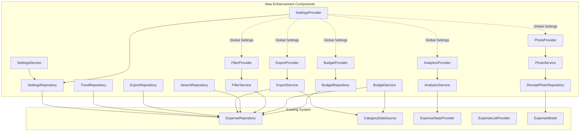

# Component Architecture

## New Components

### Budget Management Component

**Responsibility:** Manage budget creation, tracking, and alerts for expense categories
**Integration Points:** Integrates with existing expense statistics and category management

**Key Interfaces:**

- `BudgetRepository` - Data access for budget operations
- `BudgetProvider` - Riverpod state management for budgets
- `BudgetService` - Business logic for budget calculations and alerts

**Dependencies:**

- **Existing Components:** ExpenseRepository, CategoryDataSource, ExpenseStatsProvider
- **New Components:** BudgetRepository, BudgetProvider, BudgetService

**Technology Stack:** Hive database, Riverpod state management, follows existing Clean Architecture patterns

### Receipt Photo Component

**Responsibility:** Handle photo capture, storage, and association with expenses
**Integration Points:** Extends existing expense creation and detail views

**Key Interfaces:**

- `ReceiptPhotoRepository` - Data access for photo storage
- `PhotoService` - Business logic for photo processing and storage
- `PhotoProvider` - Riverpod state management for photo operations

**Dependencies:**

- **Existing Components:** ExpenseRepository, ExpenseModel
- **New Components:** ReceiptPhotoRepository, PhotoService, PhotoProvider

**Technology Stack:** image_picker, path_provider, Hive database, follows existing patterns

### Advanced Filtering Component

**Responsibility:** Provide advanced search and filtering capabilities for expenses
**Integration Points:** Integrates with existing expense list and statistics

**Key Interfaces:**

- `FilterService` - Business logic for filtering and search
- `FilterProvider` - Riverpod state management for filter state
- `SearchRepository` - Data access for search operations

**Dependencies:**

- **Existing Components:** ExpenseRepository, ExpenseListProvider
- **New Components:** FilterService, FilterProvider, SearchRepository

**Technology Stack:** Extends existing Riverpod patterns, integrates with current expense data

### Data Export Component

**Responsibility:** Handle data export in various formats (CSV, JSON)
**Integration Points:** Integrates with existing expense data and settings

**Key Interfaces:**

- `ExportService` - Business logic for data export
- `ExportProvider` - Riverpod state management for export operations
- `ExportRepository` - Data access for export history

**Dependencies:**

- **Existing Components:** ExpenseRepository, CategoryDataSource
- **New Components:** ExportService, ExportProvider, ExportRepository

**Technology Stack:** csv package, share_plus, follows existing data access patterns

### Enhanced Analytics Component

**Responsibility:** Provide advanced statistics and trend analysis
**Integration Points:** Extends existing statistics screen and calculations

**Key Interfaces:**

- `AnalyticsService` - Business logic for advanced analytics
- `AnalyticsProvider` - Riverpod state management for analytics data
- `TrendRepository` - Data access for trend calculations

**Dependencies:**

- **Existing Components:** ExpenseStatsProvider, ExpenseRepository
- **New Components:** AnalyticsService, AnalyticsProvider, TrendRepository

**Technology Stack:** Extends existing fl_chart usage, follows current statistics patterns

### Settings Management Component

**Responsibility:** Manage user preferences and app configuration
**Integration Points:** Provides global settings that affect existing functionality

**Key Interfaces:**

- `SettingsRepository` - Data access for user settings
- `SettingsProvider` - Riverpod state management for settings
- `SettingsService` - Business logic for settings validation

**Dependencies:**

- **Existing Components:** All existing components (settings affect global behavior)
- **New Components:** SettingsRepository, SettingsProvider, SettingsService

**Technology Stack:** Hive database, Riverpod state management, follows existing patterns

## Component Interaction Diagram

