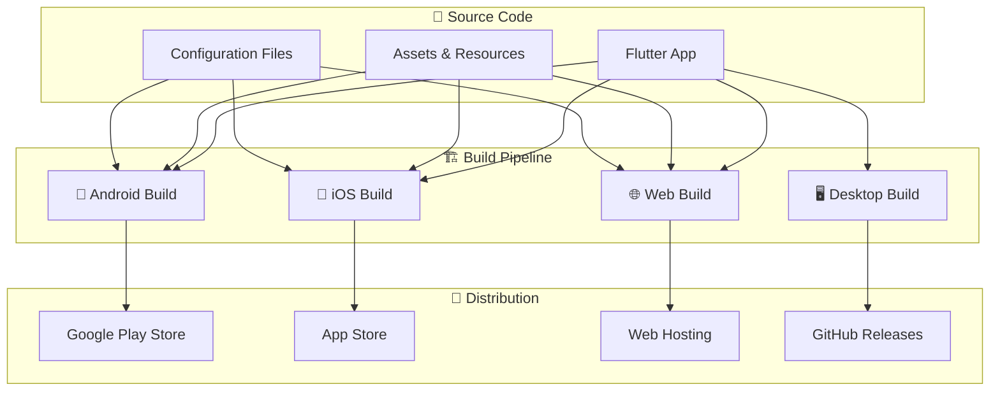

# 🚀 Deployment Guide - Expense Tracker

Complete deployment guide for the Expense Tracker Flutter application across all platforms with production-ready configurations.

---

## 📋 Table of Contents

- [🎯 Overview](#-overview)
- [📋 Prerequisites](#-prerequisites)
- [🤖 Android Deployment](#-android-deployment)
- [🍎 iOS Deployment](#-ios-deployment)  
- [🌐 Web Deployment](#-web-deployment)
- [🖥️ Desktop Deployment](#️-desktop-deployment)
- [🔄 CI/CD Pipeline](#-cicd-pipeline)
- [📊 Release Management](#-release-management)
- [🔧 Environment Configuration](#-environment-configuration)
- [🛡️ Security & Signing](#️-security--signing)
- [📈 Monitoring & Analytics](#-monitoring--analytics)
- [🐛 Troubleshooting](#-troubleshooting)

---

## 🎯 Overview

The Expense Tracker application supports deployment across multiple platforms with optimized builds and automated deployment pipelines.

### Supported Platforms

| Platform | Status | Distribution |
|----------|--------|--------------|
| **🤖 Android** | ✅ Production Ready | Google Play Store, APK |
| **🍎 iOS** | ✅ Production Ready | App Store, TestFlight |
| **🌐 Web** | ✅ Production Ready | Static Hosting, PWA |
| **🖥️ Windows** | ⚠️ Beta | MSIX, Installer |
| **🍎 macOS** | ⚠️ Beta | App Store, DMG |
| **🐧 Linux** | ⚠️ Beta | AppImage, Snap |

### Architecture Overview



---

## 📋 Prerequisites

### Development Environment

```bash
# Verify Flutter installation
flutter doctor -v

# Expected output should show:
# ✓ Flutter (Channel stable, 3.16.0)
# ✓ Android toolchain
# ✓ Xcode (for iOS development)
# ✓ Chrome (for web development)
```

### Required Tools

| Tool | Version | Purpose |
|------|---------|---------|
| **Flutter SDK** | ≥3.16.0 | Cross-platform framework |
| **Dart SDK** | ≥3.2.0 | Programming language |
| **Android Studio** | Latest | Android development |
| **Xcode** | ≥14.0 | iOS development (macOS only) |
| **Git** | Latest | Version control |
| **Firebase CLI** | Latest | Deployment automation |

### Installation Commands

```bash
# Install Flutter (if not installed)
# Follow instructions at: https://flutter.dev/docs/get-started/install

# Install Firebase CLI
npm install -g firebase-tools

# Install additional deployment tools
dart pub global activate cider    # Version management
dart pub global activate coverage # Test coverage
```

### Pre-deployment Checklist

- [ ] **All tests passing** - `flutter test` returns success
- [ ] **No analysis issues** - `flutter analyze` shows no problems  
- [ ] **Code generation complete** - `dart run build_runner build`
- [ ] **Localization files generated** - `flutter gen-l10n`
- [ ] **Version number updated** - Updated in `pubspec.yaml`
- [ ] **Release notes prepared** - Documented changes for users
- [ ] **Assets optimized** - Images compressed, unnecessary files removed
- [ ] **Security review** - No hardcoded secrets or API keys

---

## 🤖 Android Deployment

### Build Configuration

#### **gradle.properties**
```properties
# android/gradle.properties
org.gradle.jvmargs=-Xmx1536M
android.useAndroidX=true
android.enableJetifier=true
android.enableR8=true

# Performance optimizations
org.gradle.parallel=true
org.gradle.caching=true
org.gradle.daemon=true
```

#### **app/build.gradle**
```gradle
android {
    compileSdkVersion 34
    ndkVersion "23.1.7779620"

    compileOptions {
        sourceCompatibility JavaVersion.VERSION_1_8
        targetCompatibility JavaVersion.VERSION_1_8
    }

    defaultConfig {
        applicationId "com.expensetracker.app"
        minSdkVersion 21
        targetSdkVersion 34
        versionCode flutterVersionCode.toInteger()
        versionName flutterVersionName
        
        // Enable multidex for large apps
        multiDexEnabled true
    }

    buildTypes {
        release {
            signingConfig signingConfigs.release
            minifyEnabled true
            useProguard true
            proguardFiles getDefaultProguardFile('proguard-android.txt'), 'proguard-rules.pro'
        }
    }

    // Split APKs by ABI for smaller downloads
    splits {
        abi {
            enable true
            reset()
            include 'x86', 'x86_64', 'arm64-v8a', 'armeabi-v7a'
            universalApk false
        }
    }
}
```

### Debug Build

```bash
# Build debug APK
flutter build apk --debug

# Install on connected device
flutter install

# Build and run directly
flutter run --debug

# Build with specific flavor
flutter build apk --debug --flavor development
```

### Release Build

```bash
# Build release APK
flutter build apk --release

# Build App Bundle (recommended for Play Store)
flutter build appbundle --release

# Build with obfuscation (for additional security)
flutter build appbundle --release --obfuscate --split-debug-info=debug-info/

# Build for specific architectures
flutter build apk --release --split-per-abi
```

### Google Play Store Deployment

#### **Step 1: Configure Signing**

```bash
# Generate upload keystore (one-time setup)
keytool -genkey -v -keystore upload-keystore.jks -keyalg RSA \
        -keysize 2048 -validity 10000 -alias upload \
        -storetype JKS

# Create key.properties (add to android/ directory)
cat > android/key.properties << EOF
storePassword=YOUR_STORE_PASSWORD
keyPassword=YOUR_KEY_PASSWORD  
keyAlias=upload
storeFile=../upload-keystore.jks
EOF

# Add key.properties to .gitignore
echo "android/key.properties" >> .gitignore
echo "android/upload-keystore.jks" >> .gitignore
```

#### **Step 2: Configure Gradle Signing**

```gradle
// android/app/build.gradle
def keystoreProperties = new Properties()
def keystorePropertiesFile = rootProject.file('key.properties')
if (keystorePropertiesFile.exists()) {
    keystoreProperties.load(new FileInputStream(keystorePropertiesFile))
}

android {
    signingConfigs {
        release {
            keyAlias keystoreProperties['keyAlias']
            keyPassword keystoreProperties['keyPassword']
            storeFile keystoreProperties['storeFile'] ? file(keystoreProperties['storeFile']) : null
            storePassword keystoreProperties['storePassword']
        }
    }
    buildTypes {
        release {
            signingConfig signingConfigs.release
        }
    }
}
```

#### **Step 3: Build and Upload**

```bash
# Build signed App Bundle
flutter build appbundle --release

# Output location: build/app/outputs/bundle/release/app-release.aab
# Upload this file to Google Play Console
```

### Firebase App Distribution

```bash
# Install and configure Firebase CLI
firebase login
firebase init

# Build APK
flutter build apk --release

# Distribute to testers
firebase appdistribution:distribute build/app/outputs/flutter-apk/app-release.apk \
  --app 1:123456789:android:abcd1234 \
  --groups "internal-testers" \
  --release-notes "Bug fixes and performance improvements"
```

---

## 🍎 iOS Deployment

### Xcode Configuration

#### **Info.plist Settings**
```xml
<!-- ios/Runner/Info.plist -->
<key>CFBundleName</key>
<string>Expense Tracker</string>
<key>CFBundleIdentifier</key>
<string>com.expensetracker.app</string>
<key>CFBundleVersion</key>
<string>$(FLUTTER_BUILD_NUMBER)</string>
<key>CFBundleShortVersionString</key>
<string>$(FLUTTER_BUILD_NAME)</string>

<!-- Privacy usage descriptions -->
<key>NSCameraUsageDescription</key>
<string>This app needs camera access to capture receipt photos</string>
<key>NSPhotoLibraryUsageDescription</key>
<string>This app needs photo library access to save and retrieve receipt images</string>
```

#### **Runner.xcodeproj Configuration**
```bash
# Open project in Xcode
open ios/Runner.xcworkspace

# Configure in Xcode:
# - Bundle Identifier: com.expensetracker.app
# - Team: Select your Apple Developer Team
# - Signing Certificate: Apple Distribution (for App Store)
# - Deployment Target: iOS 12.0+
# - Supported Architectures: arm64 (required for App Store)
```

### Debug Build

```bash
# Build for iOS simulator
flutter build ios --debug --simulator

# Build for physical device
flutter build ios --debug

# Run on connected iOS device
flutter run --debug

# Build with specific scheme
flutter build ios --debug --flavor development
```

### Release Build

```bash
# Build release iOS app
flutter build ios --release

# Build with code signing
flutter build ios --release --no-codesign

# Build for specific configuration
flutter build ios --release --flavor production
```

### App Store Deployment

#### **Step 1: Prepare for Archive**

```bash
# Clean build folder
flutter clean
flutter pub get

# Generate necessary files
dart run build_runner build --delete-conflicting-outputs
flutter gen-l10n

# Build for release
flutter build ios --release
```

#### **Step 2: Archive in Xcode**

```bash
# Open workspace
open ios/Runner.xcworkspace

# In Xcode:
# 1. Select "Runner" scheme
# 2. Select "Any iOS Device (arm64)"
# 3. Product > Archive
# 4. Wait for archive to complete
```

#### **Step 3: Upload to App Store Connect**

```bash
# Option 1: Using Xcode Organizer
# - Window > Organizer
# - Select your archive
# - Click "Distribute App"
# - Choose "App Store Connect"
# - Follow the wizard

# Option 2: Using command line
xcodebuild -exportArchive \
  -archivePath build/Runner.xcarchive \
  -exportOptionsPlist ios/ExportOptions.plist \
  -exportPath build/ios/ipa

# Option 3: Using Transporter app
# - Download Transporter from Mac App Store
# - Drag .ipa file to upload
```

#### **ExportOptions.plist**
```xml
<?xml version="1.0" encoding="UTF-8"?>
<!DOCTYPE plist PUBLIC "-//Apple//DTD PLIST 1.0//EN" "http://www.apple.com/DTDs/PropertyList-1.0.dtd">
<plist version="1.0">
<dict>
    <key>method</key>
    <string>app-store</string>
    <key>uploadBitcode</key>
    <false/>
    <key>compileBitcode</key>
    <false/>
    <key>uploadSymbols</key>
    <true/>
</dict>
</plist>
```

### TestFlight Distribution

```bash
# Build and archive as above
# In Xcode Organizer:
# 1. Select archive
# 2. Distribute App > App Store Connect
# 3. Check "Upload" 
# 4. TestFlight will process the build
# 5. Add external testers via App Store Connect
```

---

## 🌐 Web Deployment

### Build Configuration

#### **web/index.html**
```html
<!DOCTYPE html>
<html>
<head>
  <base href="$FLUTTER_BASE_HREF">
  
  <meta charset="UTF-8">
  <meta name="viewport" content="width=device-width, initial-scale=1">
  <meta name="description" content="A beautiful expense tracking application">
  <meta name="keywords" content="expense, budget, finance, tracking">
  
  <!-- PWA Configuration -->
  <link rel="manifest" href="manifest.json">
  <link rel="icon" type="image/png" href="favicon.png"/>
  
  <!-- iOS PWA Configuration -->
  <meta name="apple-mobile-web-app-capable" content="yes">
  <meta name="apple-mobile-web-app-title" content="Expense Tracker">
  
  <title>Expense Tracker</title>
</head>
<body>
  <!-- Loading indicator -->
  <div id="loading">
    <div class="spinner"></div>
    <p>Loading Expense Tracker...</p>
  </div>
  
  <script src="flutter.js" defer></script>
  <script>
    window.addEventListener('load', function(ev) {
      _flutter.loader.loadEntrypoint({
        serviceWorker: {
          serviceWorkerVersion: serviceWorkerVersion,
        }
      }).then(function(engineInitializer) {
        return engineInitializer.initializeEngine();
      }).then(function(appRunner) {
        return appRunner.runApp();
      });
    });
  </script>
</body>
</html>
```

#### **web/manifest.json**
```json
{
  "name": "Expense Tracker",
  "short_name": "ExpenseTracker",
  "description": "Track your expenses and manage your budget",
  "start_url": "/",
  "display": "standalone",
  "background_color": "#ffffff",
  "theme_color": "#2196F3",
  "orientation": "portrait-primary",
  "categories": ["finance", "productivity"],
  "icons": [
    {
      "src": "icons/Icon-192.png",
      "sizes": "192x192",
      "type": "image/png",
      "purpose": "any maskable"
    },
    {
      "src": "icons/Icon-512.png", 
      "sizes": "512x512",
      "type": "image/png",
      "purpose": "any maskable"
    }
  ]
}
```

### Build Commands

```bash
# Standard web build
flutter build web --release

# Build with base href (for subdirectory deployment)
flutter build web --release --base-href="/expense-tracker/"

# Build with specific web renderer
flutter build web --release --web-renderer canvaskit  # Better performance
flutter build web --release --web-renderer html       # Better compatibility

# Build with optimizations
flutter build web --release --dart-define=FLUTTER_WEB_USE_SKIA=true
```

### Static Hosting Deployment

#### **Vercel**

```bash
# Install Vercel CLI
npm i -g vercel

# Build app
flutter build web --release

# Deploy
cd build/web
vercel --prod
```

**vercel.json**
```json
{
  "version": 2,
  "builds": [
    {
      "src": "**",
      "use": "@vercel/static"
    }
  ],
  "routes": [
    {
      "src": "/(.*)",
      "dest": "/index.html"
    }
  ],
  "headers": [
    {
      "source": "/(.*)",
      "headers": [
        {
          "key": "Cache-Control",
          "value": "public, max-age=86400"
        }
      ]
    }
  ]
}
```

#### **Netlify**

```bash
# Install Netlify CLI
npm install -g netlify-cli

# Build and deploy
flutter build web --release
netlify deploy --prod --dir=build/web
```

**netlify.toml**
```toml
[build]
  command = "flutter build web --release"
  publish = "build/web"

[[redirects]]
  from = "/*"
  to = "/index.html"
  status = 200

[[headers]]
  for = "/*"
  [headers.values]
    Cache-Control = "public, max-age=86400"
    X-Frame-Options = "DENY"
    X-Content-Type-Options = "nosniff"
```

#### **Firebase Hosting**

```bash
# Install Firebase CLI
npm install -g firebase-tools

# Login and initialize
firebase login
firebase init hosting

# Configure firebase.json
# Build and deploy
flutter build web --release
firebase deploy --only hosting
```

**firebase.json**
```json
{
  "hosting": {
    "public": "build/web",
    "ignore": [
      "firebase.json",
      "**/.*",
      "**/node_modules/**"
    ],
    "rewrites": [
      {
        "source": "**",
        "destination": "/index.html"
      }
    ],
    "headers": [
      {
        "source": "**/*.@(js|css|woff2|woff|ttf)",
        "headers": [
          {
            "key": "Cache-Control",
            "value": "max-age=31536000"
          }
        ]
      }
    ]
  }
}
```

#### **GitHub Pages**

**.github/workflows/deploy-web.yml**
```yaml
name: Deploy to GitHub Pages

on:
  push:
    branches: [main]
  workflow_dispatch:

jobs:
  deploy:
    runs-on: ubuntu-latest
    
    permissions:
      contents: read
      pages: write
      id-token: write
    
    steps:
      - uses: actions/checkout@v4
      
      - uses: subosito/flutter-action@v2
        with:
          flutter-version: '3.16.0'
          
      - name: Install dependencies
        run: flutter pub get
        
      - name: Build web app
        run: flutter build web --base-href="/expense-tracker/"
        
      - name: Upload to GitHub Pages
        uses: actions/upload-pages-artifact@v2
        with:
          path: build/web
          
      - name: Deploy to GitHub Pages
        uses: actions/deploy-pages@v2
```

### PWA Optimization

```dart
// lib/main.dart
void main() async {
  WidgetsFlutterBinding.ensureInitialized();
  
  // Register service worker for PWA
  if (kIsWeb) {
    await registerServiceWorker();
  }
  
  runApp(const ExpenseTrackerApp());
}

Future<void> registerServiceWorker() async {
  if ('serviceWorker' in window.navigator) {
    try {
      await window.navigator.serviceWorker!.register('/flutter_service_worker.js');
      print('Service Worker registered successfully');
    } catch (e) {
      print('Service Worker registration failed: $e');
    }
  }
}
```

---

## 🖥️ Desktop Deployment

### Windows

#### **Build Configuration**
```bash
# Enable Windows desktop
flutter config --enable-windows-desktop

# Build Windows app
flutter build windows --release

# Build with MSIX packaging
dart pub global activate msix
flutter pub add msix
flutter pub get
dart run msix:create
```

#### **MSIX Configuration**
```yaml
# pubspec.yaml
msix_config:
  display_name: Expense Tracker
  publisher_display_name: Your Company
  identity_name: com.yourcompany.expensetracker
  msix_version: 1.0.0.0
  logo_path: assets\icons\app_icon.png
  store_logo_path: assets\icons\store_logo.png
  capabilities: 'internetClient,musicLibrary,picturesLibrary'
  languages: en-us, es-es
```

#### **Windows Installer (Inno Setup)**
```pascal
; installer.iss
[Setup]
AppName=Expense Tracker
AppVersion=1.0.0
DefaultDirName={autopf}\Expense Tracker
DefaultGroupName=Expense Tracker
OutputBaseFilename=ExpenseTracker_Setup
Compression=lzma
SolidCompression=yes

[Files]
Source: "build\windows\runner\Release\*"; DestDir: "{app}"; Flags: ignoreversion recursesubdirs createallsubdirs

[Icons]
Name: "{group}\Expense Tracker"; Filename: "{app}\expense_tracker.exe"
Name: "{group}\{cm:UninstallProgram,Expense Tracker}"; Filename: "{uninstallexe}"
```

### macOS

#### **Build Configuration**
```bash
# Enable macOS desktop
flutter config --enable-macos-desktop

# Build macOS app
flutter build macos --release

# Create app bundle
flutter build macos --release
```

#### **Code Signing**
```bash
# Sign the app (requires Apple Developer account)
codesign --force --verify --verbose \
  --sign "Developer ID Application: Your Name (TEAM_ID)" \
  build/macos/Build/Products/Release/expense_tracker.app

# Create DMG installer
hdiutil create -volname "Expense Tracker" \
  -srcfolder build/macos/Build/Products/Release/expense_tracker.app \
  -ov -format UDZO ExpenseTracker.dmg
```

#### **App Store Distribution**
```bash
# Build for App Store
flutter build macos --release

# Package for App Store
productbuild --component build/macos/Build/Products/Release/expense_tracker.app \
  /Applications ExpenseTracker.pkg

# Upload using Transporter or Application Loader
```

### Linux

#### **Build Configuration**
```bash
# Enable Linux desktop
flutter config --enable-linux-desktop

# Build Linux app
flutter build linux --release

# Create AppImage (requires appimagetool)
./appimagetool build/linux/x64/release/bundle/ ExpenseTracker-x86_64.AppImage
```

#### **Snap Package**
```yaml
# snap/snapcraft.yaml
name: expense-tracker
base: core20
version: '1.0.0'
summary: Personal expense tracking application
description: |
  A beautiful and intuitive expense tracker built with Flutter.
  Track expenses, manage budgets, and analyze spending patterns.

grade: stable
confinement: strict

apps:
  expense-tracker:
    command: expense_tracker
    extensions: [flutter-stable]
    plugs:
      - network
      - home

parts:
  expense-tracker:
    source: .
    plugin: flutter
    flutter-target: lib/main.dart
```

```bash
# Build snap
snapcraft

# Install locally
sudo snap install expense-tracker_1.0.0_amd64.snap --dangerous

# Publish to Snap Store
snapcraft upload expense-tracker_1.0.0_amd64.snap
snapcraft release expense-tracker 1.0.0 stable
```

---

## 🔄 CI/CD Pipeline

### GitHub Actions Workflow

**.github/workflows/build-and-deploy.yml**
```yaml
name: Build and Deploy

on:
  push:
    tags: ['v*']
  workflow_dispatch:
    inputs:
      environment:
        description: 'Deployment environment'
        required: true
        default: 'staging'
        type: choice
        options:
        - staging
        - production

env:
  FLUTTER_VERSION: '3.16.0'

jobs:
  test:
    runs-on: ubuntu-latest
    steps:
      - uses: actions/checkout@v4
      
      - uses: subosito/flutter-action@v2
        with:
          flutter-version: ${{ env.FLUTTER_VERSION }}
          
      - name: Get dependencies
        run: flutter pub get
        
      - name: Run tests
        run: flutter test --coverage
        
      - name: Upload coverage
        uses: codecov/codecov-action@v3
        with:
          file: coverage/lcov.info

  build-android:
    needs: test
    runs-on: ubuntu-latest
    steps:
      - uses: actions/checkout@v4
      
      - uses: actions/setup-java@v3
        with:
          distribution: 'zulu'
          java-version: '17'
          
      - uses: subosito/flutter-action@v2
        with:
          flutter-version: ${{ env.FLUTTER_VERSION }}
          
      - name: Decode keystore
        run: |
          echo "${{ secrets.ANDROID_KEYSTORE }}" | base64 -d > android/upload-keystore.jks
          
      - name: Create key.properties
        run: |
          echo "storePassword=${{ secrets.ANDROID_STORE_PASSWORD }}" > android/key.properties
          echo "keyPassword=${{ secrets.ANDROID_KEY_PASSWORD }}" >> android/key.properties
          echo "keyAlias=${{ secrets.ANDROID_KEY_ALIAS }}" >> android/key.properties
          echo "storeFile=../upload-keystore.jks" >> android/key.properties
          
      - name: Build APK
        run: flutter build apk --release
        
      - name: Build App Bundle
        run: flutter build appbundle --release
        
      - name: Upload to Play Store
        uses: r0adkll/upload-google-play@v1
        with:
          serviceAccountJsonPlainText: ${{ secrets.GOOGLE_PLAY_SERVICE_ACCOUNT }}
          packageName: com.expensetracker.app
          releaseFiles: build/app/outputs/bundle/release/app-release.aab
          track: internal
          status: draft

  build-ios:
    needs: test
    runs-on: macos-latest
    steps:
      - uses: actions/checkout@v4
      
      - uses: subosito/flutter-action@v2
        with:
          flutter-version: ${{ env.FLUTTER_VERSION }}
          
      - name: Install certificates and provisioning profiles
        env:
          BUILD_CERTIFICATE_BASE64: ${{ secrets.BUILD_CERTIFICATE_BASE64 }}
          P12_PASSWORD: ${{ secrets.P12_PASSWORD }}
          PROVISIONING_PROFILE_BASE64: ${{ secrets.PROVISIONING_PROFILE_BASE64 }}
          KEYCHAIN_PASSWORD: ${{ secrets.KEYCHAIN_PASSWORD }}
        run: |
          # Create keychain
          security create-keychain -p "$KEYCHAIN_PASSWORD" build.keychain
          security set-keychain-settings -lut 21600 build.keychain
          security unlock-keychain -p "$KEYCHAIN_PASSWORD" build.keychain
          
          # Import certificate
          echo -n "$BUILD_CERTIFICATE_BASE64" | base64 --decode --output certificate.p12
          security import certificate.p12 -k build.keychain -P "$P12_PASSWORD" -T /usr/bin/codesign
          security set-key-partition-list -S apple-tool:,apple:,codesign: -s -k "$KEYCHAIN_PASSWORD" build.keychain
          
          # Install provisioning profile
          mkdir -p ~/Library/MobileDevice/Provisioning\ Profiles
          echo -n "$PROVISIONING_PROFILE_BASE64" | base64 --decode --output ~/Library/MobileDevice/Provisioning\ Profiles/build_pp.mobileprovision
          
      - name: Build iOS
        run: |
          flutter build ios --release --no-codesign
          
      - name: Archive and export
        run: |
          xcodebuild -workspace ios/Runner.xcworkspace \
            -scheme Runner \
            -configuration Release \
            -destination generic/platform=iOS \
            -archivePath build/Runner.xcarchive \
            archive
            
          xcodebuild -exportArchive \
            -archivePath build/Runner.xcarchive \
            -exportOptionsPlist ios/ExportOptions.plist \
            -exportPath build/ios/ipa
            
      - name: Upload to App Store Connect
        uses: apple-actions/upload-testflight-build@v1
        with:
          app-path: build/ios/ipa/Runner.ipa
          issuer-id: ${{ secrets.APPSTORE_ISSUER_ID }}
          api-key-id: ${{ secrets.APPSTORE_KEY_ID }}
          api-private-key: ${{ secrets.APPSTORE_PRIVATE_KEY }}

  build-web:
    needs: test
    runs-on: ubuntu-latest
    steps:
      - uses: actions/checkout@v4
      
      - uses: subosito/flutter-action@v2
        with:
          flutter-version: ${{ env.FLUTTER_VERSION }}
          
      - name: Build web
        run: flutter build web --release --base-href="/expense-tracker/"
        
      - name: Deploy to Firebase Hosting
        uses: FirebaseExtended/action-hosting-deploy@v0
        with:
          repoToken: '${{ secrets.GITHUB_TOKEN }}'
          firebaseServiceAccount: '${{ secrets.FIREBASE_SERVICE_ACCOUNT }}'
          projectId: expense-tracker-prod
          channelId: live

  build-desktop:
    needs: test
    strategy:
      matrix:
        platform: [windows, macos, linux]
        include:
          - platform: windows
            os: windows-latest
            output: windows
          - platform: macos
            os: macos-latest
            output: macos
          - platform: linux
            os: ubuntu-latest
            output: linux
    runs-on: ${{ matrix.os }}
    steps:
      - uses: actions/checkout@v4
      
      - uses: subosito/flutter-action@v2
        with:
          flutter-version: ${{ env.FLUTTER_VERSION }}
          
      - name: Enable desktop
        run: flutter config --enable-${{ matrix.platform }}-desktop
        
      - name: Build desktop app
        run: flutter build ${{ matrix.platform }} --release
        
      - name: Create installer (Windows)
        if: matrix.platform == 'windows'
        run: |
          dart pub global activate msix
          dart run msix:create
          
      - name: Create DMG (macOS)
        if: matrix.platform == 'macos'
        run: |
          hdiutil create -volname "Expense Tracker" \
            -srcfolder build/macos/Build/Products/Release/expense_tracker.app \
            -ov -format UDZO ExpenseTracker.dmg
            
      - name: Create AppImage (Linux)
        if: matrix.platform == 'linux'
        run: |
          wget https://github.com/AppImage/AppImageKit/releases/download/continuous/appimagetool-x86_64.AppImage
          chmod +x appimagetool-x86_64.AppImage
          ./appimagetool-x86_64.AppImage build/linux/x64/release/bundle/ ExpenseTracker-x86_64.AppImage
          
      - name: Upload artifacts
        uses: actions/upload-artifact@v3
        with:
          name: expense-tracker-${{ matrix.platform }}
          path: |
            build/${{ matrix.output }}/
            *.dmg
            *.AppImage
            *.msix

  release:
    needs: [build-android, build-ios, build-web, build-desktop]
    runs-on: ubuntu-latest
    if: startsWith(github.ref, 'refs/tags/')
    steps:
      - uses: actions/checkout@v4
      
      - name: Download all artifacts
        uses: actions/download-artifact@v3
        
      - name: Create GitHub Release
        uses: softprops/action-gh-release@v1
        with:
          files: |
            **/*.apk
            **/*.aab
            **/*.ipa
            **/*.dmg
            **/*.AppImage
            **/*.msix
          body: |
            ## Changes in this release
            - Bug fixes and performance improvements
            - New features and enhancements
            
            ## Download
            - **Android**: Download the APK or install from Google Play Store
            - **iOS**: Available on the App Store or TestFlight
            - **Web**: Access at [expense-tracker.app](https://expense-tracker.app)
            - **Desktop**: Download the installer for your platform
```

---

## 📊 Release Management

### Version Management

#### **Semantic Versioning**
```yaml
# pubspec.yaml
version: 1.2.3+45
# Format: MAJOR.MINOR.PATCH+BUILD
# MAJOR: Breaking changes
# MINOR: New features (backward compatible)
# PATCH: Bug fixes
# BUILD: Build number (auto-incremented)
```

#### **Automated Version Bumping**
```bash
# Install cider for version management
dart pub global activate cider

# Bump version types
cider bump patch  # 1.2.3 → 1.2.4
cider bump minor  # 1.2.3 → 1.3.0
cider bump major  # 1.2.3 → 2.0.0

# Bump build number
cider bump build  # 1.2.3+45 → 1.2.3+46

# Set specific version
cider version 2.0.0+1
```

### Release Notes Generation

```bash
# Generate changelog from git commits
git log --oneline --pretty=format:"%h %s" v1.2.2..HEAD > CHANGELOG.md

# Using conventional commits
npm install -g standard-version
standard-version

# Create GitHub release
gh release create v1.2.3 \
  --title "Release v1.2.3" \
  --notes-file RELEASE_NOTES.md \
  build/app/outputs/bundle/release/app-release.aab \
  build/ios/ipa/Runner.ipa
```

#### **Release Notes Template**
```markdown
# Release v1.2.3

## 🚀 New Features
- Added expense photo capture functionality
- Implemented advanced filtering options
- Enhanced budget tracking with alerts

## 🐛 Bug Fixes  
- Fixed expense deletion confirmation dialog
- Resolved date picker localization issues
- Corrected chart rendering on small screens

## 🔧 Improvements
- Improved app startup performance by 30%
- Enhanced UI responsiveness on tablets
- Updated Spanish translations

## 📱 Platform Updates
- **Android**: Minimum SDK version increased to 21
- **iOS**: Added support for iOS 17 features
- **Web**: Improved PWA functionality

## 🔒 Security
- Updated dependencies to latest secure versions
- Enhanced data validation and sanitization

## 📋 Technical Details
- Flutter version: 3.16.0
- Dart version: 3.2.0
- Build number: 45
```

### Environment Management

#### **Environment Configuration**
```dart
// lib/config/environment.dart
enum Environment { development, staging, production }

class EnvironmentConfig {
  static const Environment current = Environment.values.firstWhere(
    (e) => e.name == String.fromEnvironment('ENVIRONMENT', defaultValue: 'development'),
  );

  static const String apiUrl = String.fromEnvironment(
    'API_URL',
    defaultValue: 'https://api.dev.expensetracker.com',
  );

  static const bool enableAnalytics = bool.fromEnvironment('ENABLE_ANALYTICS', defaultValue: false);
  static const bool enableCrashReporting = bool.fromEnvironment('ENABLE_CRASH_REPORTING', defaultValue: false);
  static const String sentryDsn = String.fromEnvironment('SENTRY_DSN', defaultValue: '');

  static bool get isProduction => current == Environment.production;
  static bool get isDevelopment => current == Environment.development;
  static bool get isStaging => current == Environment.staging;
}
```

#### **Build with Environment Variables**
```bash
# Development build
flutter build apk --release \
  --dart-define=ENVIRONMENT=development \
  --dart-define=API_URL=https://api.dev.expensetracker.com \
  --dart-define=ENABLE_ANALYTICS=false

# Staging build  
flutter build apk --release \
  --dart-define=ENVIRONMENT=staging \
  --dart-define=API_URL=https://api.staging.expensetracker.com \
  --dart-define=ENABLE_ANALYTICS=true \
  --dart-define=SENTRY_DSN=https://staging-sentry-dsn

# Production build
flutter build appbundle --release \
  --dart-define=ENVIRONMENT=production \
  --dart-define=API_URL=https://api.expensetracker.com \
  --dart-define=ENABLE_ANALYTICS=true \
  --dart-define=ENABLE_CRASH_REPORTING=true \
  --dart-define=SENTRY_DSN=https://production-sentry-dsn
```

---

## 🔧 Environment Configuration

### Development vs Production

#### **Feature Flags**
```dart
// lib/config/feature_flags.dart
class FeatureFlags {
  static const bool enableBetaFeatures = bool.fromEnvironment('ENABLE_BETA_FEATURES', defaultValue: false);
  static const bool enableDebugMode = bool.fromEnvironment('ENABLE_DEBUG_MODE', defaultValue: false);
  static const bool enablePerformanceLogging = bool.fromEnvironment('ENABLE_PERFORMANCE_LOGGING', defaultValue: false);
  
  // Feature-specific flags
  static const bool enableAdvancedAnalytics = bool.fromEnvironment('ENABLE_ADVANCED_ANALYTICS', defaultValue: false);
  static const bool enableCloudSync = bool.fromEnvironment('ENABLE_CLOUD_SYNC', defaultValue: false);
  static const bool enablePushNotifications = bool.fromEnvironment('ENABLE_PUSH_NOTIFICATIONS', defaultValue: false);
}
```

#### **Configuration Files**
```yaml
# config/development.yaml
api:
  baseUrl: https://api.dev.expensetracker.com
  timeout: 30
  retryAttempts: 3

logging:
  level: debug
  enableFileLogging: true

features:
  enableBetaFeatures: true
  enableDebugMode: true

---
# config/production.yaml  
api:
  baseUrl: https://api.expensetracker.com
  timeout: 15
  retryAttempts: 2

logging:
  level: error
  enableFileLogging: false

features:
  enableBetaFeatures: false
  enableDebugMode: false
```

### Build Configurations

#### **Flutter Build Flavors**
```gradle
// android/app/build.gradle
android {
    flavorDimensions "environment"
    
    productFlavors {
        development {
            dimension "environment"
            applicationIdSuffix ".dev"
            versionNameSuffix "-dev"
            resValue "string", "app_name", "Expense Tracker Dev"
        }
        
        staging {
            dimension "environment"
            applicationIdSuffix ".staging"
            versionNameSuffix "-staging"
            resValue "string", "app_name", "Expense Tracker Staging"
        }
        
        production {
            dimension "environment"
            resValue "string", "app_name", "Expense Tracker"
        }
    }
}
```

```bash
# Build with specific flavor
flutter build apk --release --flavor development
flutter build apk --release --flavor staging  
flutter build apk --release --flavor production
```

---

## 🛡️ Security & Signing

### Code Obfuscation

```bash
# Build with obfuscation
flutter build apk --release --obfuscate --split-debug-info=debug-info/
flutter build appbundle --release --obfuscate --split-debug-info=debug-info/
flutter build ios --release --obfuscate --split-debug-info=debug-info/
```

### Secrets Management

#### **Environment Variables**
```bash
# Never commit secrets to version control
echo "GOOGLE_SERVICES_JSON=..." >> .env.local
echo "APPLE_CERTIFICATES=..." >> .env.local
echo ".env.local" >> .gitignore
```

#### **GitHub Secrets**
```yaml
# Required secrets in GitHub repository
ANDROID_KEYSTORE              # Base64 encoded keystore
ANDROID_STORE_PASSWORD         # Keystore password
ANDROID_KEY_PASSWORD           # Key password  
ANDROID_KEY_ALIAS             # Key alias

BUILD_CERTIFICATE_BASE64      # iOS distribution certificate
P12_PASSWORD                  # Certificate password
PROVISIONING_PROFILE_BASE64   # iOS provisioning profile
KEYCHAIN_PASSWORD            # Keychain password

APPSTORE_ISSUER_ID           # App Store Connect issuer ID
APPSTORE_KEY_ID              # App Store Connect key ID
APPSTORE_PRIVATE_KEY         # App Store Connect private key

GOOGLE_PLAY_SERVICE_ACCOUNT  # Play Store service account JSON
FIREBASE_SERVICE_ACCOUNT     # Firebase service account JSON
```

### Certificate Management

#### **Android Keystore Backup**
```bash
# Create keystore backup
cp upload-keystore.jks upload-keystore-backup.jks

# Store backup securely (encrypted cloud storage)
gpg --symmetric --cipher-algo AES256 upload-keystore-backup.jks

# Document keystore information
echo "Keystore: upload-keystore.jks" > keystore-info.txt
echo "Alias: upload" >> keystore-info.txt  
echo "Created: $(date)" >> keystore-info.txt
```

#### **iOS Certificate Management**
```bash
# Export certificates from Keychain
security find-identity -v -p codesigning

# Export certificate for CI/CD
security export -t cert -f pkcs12 -k login.keychain -P "password" \
  -o distribution_certificate.p12 "Apple Distribution: Your Name"

# Convert to base64 for GitHub secrets  
base64 -i distribution_certificate.p12 -o certificate_base64.txt
```

---

## 📈 Monitoring & Analytics

### Crash Reporting (Sentry)

#### **Setup**
```yaml
# pubspec.yaml
dependencies:
  sentry_flutter: ^7.9.0
```

```dart
// lib/main.dart
import 'package:sentry_flutter/sentry_flutter.dart';

Future<void> main() async {
  await SentryFlutter.init(
    (options) {
      options.dsn = EnvironmentConfig.sentryDsn;
      options.environment = EnvironmentConfig.current.name;
      options.release = 'expense_tracker@1.2.3+45';
      options.enableAutoSessionTracking = true;
      options.sessionTrackingIntervalMillis = 10000;
    },
    appRunner: () => runApp(const ExpenseTrackerApp()),
  );
}
```

### Performance Monitoring

```dart
// lib/utils/performance_monitor.dart
class PerformanceMonitor {
  static const bool _enabled = bool.fromEnvironment('ENABLE_PERFORMANCE_MONITORING');
  
  static void startTransaction(String name) {
    if (!_enabled) return;
    
    final transaction = Sentry.startTransaction(name, 'task');
    Sentry.configureScope((scope) => scope.setSpan(transaction));
  }
  
  static void finishTransaction() {
    if (!_enabled) return;
    
    Sentry.getSpan()?.finish();
  }
  
  static void recordMetric(String name, double value) {
    if (!_enabled) return;
    
    Sentry.metrics.increment(name, value: value);
  }
}
```

### User Analytics (Optional)

```dart
// lib/services/analytics_service.dart  
class AnalyticsService {
  static const bool _enabled = EnvironmentConfig.enableAnalytics;
  
  static Future<void> logEvent(String name, Map<String, dynamic> parameters) async {
    if (!_enabled) return;
    
    // Implementation for your analytics provider
    // Firebase Analytics, Mixpanel, etc.
  }
  
  static Future<void> setUserProperty(String name, String value) async {
    if (!_enabled) return;
    
    // Set user properties
  }
}
```

---

## 🐛 Troubleshooting

### Common Build Issues

#### **Android Build Failures**

```bash
# Clear build cache
flutter clean
cd android && ./gradlew clean && cd ..

# Fix Gradle dependency issues
cd android
./gradlew --refresh-dependencies
cd ..

# Update Android SDK
flutter doctor --android-licenses

# Fix multidex issues (if app exceeds 64k methods)
# Add to android/app/build.gradle:
defaultConfig {
    multiDexEnabled true
}
dependencies {
    implementation 'androidx.multidex:multidex:2.0.1'
}
```

#### **iOS Build Failures**

```bash
# Clean iOS build
cd ios
rm -rf Pods/ Podfile.lock
pod install --repo-update
cd ..

# Clear derived data
rm -rf ~/Library/Developer/Xcode/DerivedData/

# Update CocoaPods
gem update cocoapods
pod repo update

# Fix signing issues
open ios/Runner.xcworkspace
# Check signing settings in Xcode
```

#### **Web Build Failures**

```bash
# Clear web build cache
flutter clean
flutter pub get

# Enable web support
flutter config --enable-web

# Fix CORS issues in development
flutter run -d chrome --web-renderer html --web-port 8080

# Build with alternative renderer
flutter build web --web-renderer canvaskit
```

### Deployment Issues

#### **Play Store Rejection**

Common issues and solutions:
- **Target API Level**: Update `targetSdkVersion` in `android/app/build.gradle`
- **Permissions**: Review and minimize requested permissions
- **Content Rating**: Ensure app content matches declared rating
- **Privacy Policy**: Required for apps that collect user data

#### **App Store Rejection**

Common issues and solutions:
- **Missing Usage Descriptions**: Add all required `NSUsageDescription` keys
- **App Transport Security**: Configure ATS settings if needed
- **Binary Validation**: Use Xcode's built-in validation before submission
- **Metadata**: Ensure screenshots and descriptions match app functionality

#### **Web Deployment Issues**

```bash
# Fix routing issues
# Ensure proper base href configuration
flutter build web --base-href="/your-path/"

# Fix MIME type issues
# Configure server to serve .wasm files correctly:
# Content-Type: application/wasm

# Fix CORS issues  
# Configure CORS headers on your server
# Access-Control-Allow-Origin: *
```

### Performance Issues

```bash
# Profile app performance
flutter run --profile

# Analyze bundle size
flutter build web --analyze-size

# Debug memory leaks
flutter run --debug --enable-software-rendering

# Check for unnecessary rebuilds
flutter run --debug --enable-widget-inspector
```

### Debug Commands

```bash
# Verbose logging
flutter run --verbose

# Device-specific issues
flutter devices
flutter run -d <device_id> --verbose

# Check Flutter installation
flutter doctor -v

# Analyze dependencies
flutter pub deps

# Check for outdated packages
flutter pub outdated
```

---

## 🚀 Production Readiness Checklist

### Pre-Release

- [ ] **All tests passing** - Unit, widget, and integration tests
- [ ] **Performance optimized** - App launch time, memory usage, battery drain
- [ ] **Security hardened** - No exposed secrets, input validation, secure storage
- [ ] **Accessibility tested** - Screen readers, keyboard navigation, contrast ratios
- [ ] **Cross-platform tested** - iOS, Android, Web on different devices/browsers
- [ ] **Offline functionality** - Handles network failures gracefully
- [ ] **Error handling** - User-friendly error messages, crash reporting
- [ ] **Data migration** - Handles app updates without data loss
- [ ] **Legal compliance** - Privacy policy, terms of service, GDPR compliance

### Post-Release

- [ ] **Monitoring active** - Crash reporting, performance monitoring, user analytics
- [ ] **User feedback** - App store reviews, in-app feedback system
- [ ] **A/B testing** - Feature flags for gradual rollouts
- [ ] **Update mechanism** - In-app update prompts, backwards compatibility
- [ ] **Support documentation** - User guides, FAQ, troubleshooting
- [ ] **Rollback plan** - Ability to quickly rollback problematic releases

---

**🚀 Deploy with confidence! Your Expense Tracker is ready for production.**

*This comprehensive deployment guide ensures your application reaches users seamlessly across all platforms with enterprise-grade reliability and security.*